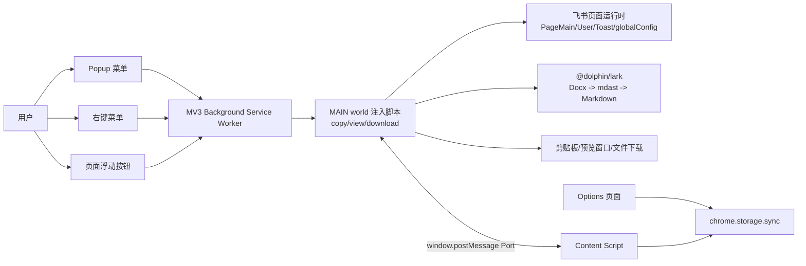
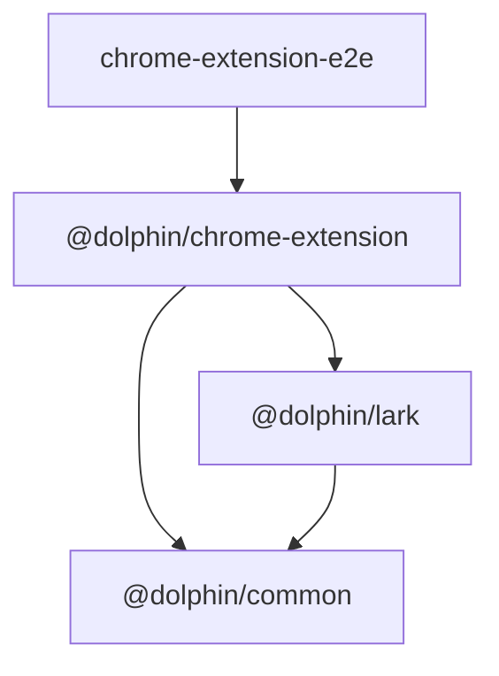
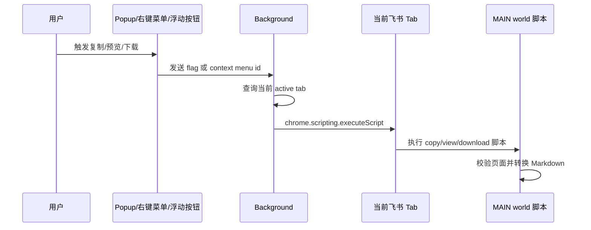

# Cloud Document Converter 架构设计文档

最后更新：2026-06-10

## 1. 背景

Cloud Document Converter 是一个 Chrome Extension，用于在飞书/Lark 云文档页面中把 Docx 文档转换为 Markdown，并支持复制、预览和下载。项目采用 pnpm workspace + Turborepo 的 monorepo 结构，将浏览器扩展、核心转换引擎、公共工具和 E2E 测试分层维护。

## 2. 设计目标

### 2.1 业务目标

- 在飞书/Lark Docx 页面内提供低摩擦的 Markdown 导出能力。
- 支持三类用户动作：复制 Markdown、预览 Markdown、下载 Markdown 或包含资源的 Zip。
- 尽量保留文档结构，包括标题层级、列表、任务列表、表格、图片、附件、白板、流程图、iframe、内联样式和部分 ISV 块。
- 为不同用户偏好提供可配置项，如语言、主题、表格输出方式、布局 Grid 输出方式、文本高亮和文件命名策略。

### 2.2 技术目标

- 核心转换逻辑与扩展 UI 解耦，便于单测、复用和独立发布。
- 运行时依赖浏览器扩展权限，但转换逻辑尽量只依赖飞书页面暴露的运行时对象。
- 支持 Manifest V3 的 Chrome 扩展运行模型，同时保留 Firefox 构建适配入口。
- 使用 AST 作为中间表示，降低 Markdown 字符串拼接带来的格式风险。
- 用 E2E 覆盖真实飞书页面中的关键转换路径。

### 2.3 非目标

- 不实现独立后端服务，转换过程在浏览器本地完成。
- 不支持旧版飞书 Doc 1.0 页面转换，当前只支持 Docx。
- 不保证覆盖所有飞书私有块类型，无法识别或不稳定的块会被跳过或降级处理。

## 3. 总体架构

系统由五个主要层次组成：

1. 扩展入口层：`manifest.json` 声明权限、页面、content script 和 background service worker。
2. 用户交互层：Popup、Options、右键菜单、飞书页面浮动按钮。
3. 执行编排层：Background 根据用户动作向当前 Tab 注入具体功能脚本。
4. 转换引擎层：`@dolphin/lark` 从飞书页面运行时读取 Docx block tree，转换为 mdast，再序列化为 Markdown。
5. 公共基础设施层：`@dolphin/common` 提供消息桥、等待、时间常量、DOM、图片和 SVG 工具。

## 4. Monorepo 模块划分

| 模块 | 路径 | 职责 |
| --- | --- | --- |
| 根工作区 | `package.json`, `pnpm-workspace.yaml`, `turbo.json` | 统一脚本、依赖目录、Turborepo 任务缓存 |
| Chrome Extension | `apps/chrome-extension` | MV3 扩展应用、Vue 页面、content/background/injected scripts、扩展构建 |
| Extension E2E | `apps/chrome-extension-e2e` | Playwright 扩展 E2E，包含真实飞书页面复制 Markdown 验证 |
| Lark 转换库 | `packages/lark` | 飞书 Docx block 模型适配、mdast 转换、Markdown 序列化、图片/文件 URL 解析 |
| Common 工具库 | `packages/common` | 跨包通用工具、window message Port、时间常量、图片/SVG/DOM 工具 |
| TS 配置 | `packages/typescript-config` | workspace 共享 TypeScript 配置 |
| 版本变更 | `.changeset` | 多包发布变更记录 |

依赖方向保持为应用依赖库：

## 5. 浏览器扩展架构

### 5.1 Manifest 与权限

`apps/chrome-extension/manifest.json` 使用 Manifest V3：

- `action.default_popup` 指向 `pages/popup.html`。
- `options_page` 指向 `pages/options.html`。
- `background.service_worker` 指向 `bundles/background.js`。
- `content_scripts` 在飞书/Lark 相关域名下加载 `bundles/content.js`。
- 权限包括 `contextMenus`、`scripting`、`storage`。
- host permissions 限定在 `feishu.cn`、`feishu.net`、`larksuite.com`、`feishu-pre.net`、`larkoffice.com`、`larkenterprise.com` 等域名。

### 5.2 Background Service Worker

入口：`apps/chrome-extension/src/background.ts`

主要职责：

- 在扩展安装时注册三个右键菜单：
  - 下载为 Markdown
  - 复制为 Markdown
  - 查看 Markdown
- 接收右键菜单点击事件，根据菜单 ID 注入对应脚本。
- 接收 Popup 或页面浮动按钮发来的 `chrome.runtime.sendMessage`，查询当前激活 Tab 并注入对应脚本。
- 通过 `chrome.scripting.executeScript` 把功能脚本注入到 `world: 'MAIN'`，让脚本可以访问飞书页面暴露在主世界的运行时对象。

### 5.3 Content Script

入口：`apps/chrome-extension/src/content.ts`

主要职责：

- 在飞书 Docx 页面上渲染三个固定定位浮动按钮：复制、预览、下载。
- 监听飞书页面 DOM 变化，等待页面右侧帮助/评论按钮等锚点出现后计算按钮位置。
- 监听 SPA 路由切换，清理旧按钮并重新初始化。
- 作为 MAIN world 注入脚本与扩展 API 之间的桥：
  - 注入脚本不能直接稳定访问扩展 storage。
  - 注入脚本通过 `window.postMessage` 发送 `GetSettings` 请求。
  - Content script 接收请求后调用 `chrome.storage.sync.get` 并返回结果。

### 5.4 Popup 页面

入口：`apps/chrome-extension/src/pages/popup/popup.vue`

Popup 是轻量命令菜单，包含：

- 查看 Markdown
- 复制 Markdown
- 下载 Markdown
- 帮助与反馈
- 打开设置页

在生产环境中，操作项通过 `chrome.runtime.sendMessage({ flag })` 交给 background 注入脚本；在开发环境中输出调试日志或打开本地 options 路由。

### 5.5 Options 页面

入口：

- `apps/chrome-extension/src/pages/options/options.vue`
- `apps/chrome-extension/src/pages/options/general.vue`
- `apps/chrome-extension/src/pages/options/download.vue`

Options 使用 Vue + Vue Router + TanStack Vue Query + vee-validate + zod：

- `general` 配置语言、主题、表格输出方式、Grid 输出方式、文本高亮。
- `download` 配置下载方式和资源文件唯一命名策略。
- 设置读写封装在 `apps/chrome-extension/src/pages/shared/settings.ts`。
- 开发环境下 storage 由 `apps/chrome-extension/src/lib/storage.ts` 用 `localStorage` 模拟，生产环境使用 `chrome.storage.sync`。

## 6. 运行时通信设计

### 6.1 用户动作到脚本注入

### 6.2 MAIN world 与 Content script 的设置桥

`@dolphin/common/message` 提供一个基于 `window.postMessage` 的 `Port`：

- 请求和响应都有 `__dolphin__` 标记、`from`、`to`、`name`、`id`。
- 注入脚本使用 `portImpl.sender.sendAsync(EventName.GetSettings, keys)`。
- Content script 使用 `portImpl.receiver.on(EventName.GetSettings, handler)` 从 `chrome.storage.sync` 读取设置。
- 这种方式避免在 MAIN world 中直接依赖扩展 API，同时保留访问页面运行时对象的能力。

## 7. Markdown 转换架构

核心入口：`packages/lark/src/docx.ts`

### 7.1 页面运行时适配

`packages/lark/src/env.ts` 从当前页面读取飞书运行时对象：

- `window.PageMain`：Docx block tree、定位 block 的能力。
- `window.User`：当前用户语言。
- `window.Toast`：复用飞书页面 Toast UI。
- `window.editor`：用于判断旧版 Doc 页面。

`Docx` 类对页面能力做统一封装：

- `isDocx`：当前页面是否是新版 Docx。
- `isDoc`：是否是旧版 Doc。
- `rootBlock`：读取 `PageMain.blockManager.rootBlockModel`。
- `language`：读取用户语言并归一到 `zh` 或 `en`。
- `pageTitle`：从 root block 文本推导文件名。
- `isReady`：判断 block 是否仍为 pending，以及 synced reference/whiteboard 是否准备完成。
- `scrollTo`：滚动飞书文档容器，用于触发懒加载。
- `intoMarkdownAST`：把飞书 block tree 转换成 mdast。
- `Docx.stringify`：使用 `mdast-util-to-markdown` 输出 Markdown，并启用 GFM 删除线、任务列表、表格和数学表达式扩展。

### 7.2 Transformer

`Transformer` 负责把飞书 block 转换成 mdast 节点。它维护以下转换过程状态：

- `parent`：当前 mdast 父节点，用于决定图片是否包裹 paragraph、表格替换位置等。
- `images`：转换过程中发现的图片、白板和图表资源。
- `files`：转换过程中发现的附件资源。
- `mentionUsers`：待二次解析的用户 mention。
- `tableWithParents`：待按设置后处理的 table/grid 节点及其父节点。
- `sequences`：标题自动编号状态。

主要 block 映射：

| 飞书 BlockType | Markdown/mdast 输出 |
| --- | --- |
| `PAGE` | `root` |
| `HEADING1` 至 `HEADING6` | `heading`，保留深度和自动编号 |
| `HEADING7` 至 `HEADING9`, `TEXT` | `paragraph` |
| `CODE` | fenced code block |
| `BULLET`, `ORDERED`, `TODO` | `listItem`，随后合并为 `list` |
| `QUOTE_CONTAINER`, `CALLOUT` | `blockquote` |
| `DIVIDER` | thematic break |
| `IMAGE` | `image`，记录 token 和 fetchSources |
| `WHITEBOARD` | 可选转换为图片 Blob |
| `DIAGRAM` | 可选转换为图片 Blob |
| `TABLE` | `table`，记录列宽、合并单元格和异常子节点 |
| `GRID` | `table` 或扁平化子块，取决于设置 |
| `FILE` | `link`，记录 fetchFile |
| `IFRAME` | HTML iframe |
| `ISV` 文本绘图/时间线 | Mermaid code block |
| 不支持块 | 跳过或降级 |

### 7.3 Inline 内容转换

飞书文本使用 operation/attribute 结构。转换时会处理：

- 普通文本。
- 加粗、斜体、删除线、下划线。
- 行内代码。
- 数学公式。
- 链接。
- 文本高亮，是否保留由 `general.text_highlight` 控制。
- mention 用户，先转换为占位 inlineCode，后续定位页面 DOM 解析为 `@用户名`。
- mention doc 等 inline component。

### 7.4 表格与 Grid 后处理

扩展层在 `apps/chrome-extension/src/common/utils.ts` 根据设置执行后处理：

- `general.table = filtered`：过滤复杂表格。
- `general.table = nonPhrasingContentToHTML`：仅把包含非 phrasing 内容的表格转 HTML。
- `general.table = toHTML`：把表格转 HTML。
- `general.grid = flatten`：在 Transformer 中把 Grid 子块扁平化。
- `general.grid = toTable`：把 Grid 当表格输出。
- `general.grid = toHTML`：把 Grid 转 HTML，并保留列宽。

表格转 HTML 时会处理 `rowSpan`、`colSpan` 和 `colgroup`，避免 GFM 表格无法表达复杂结构。

## 8. 三类核心业务流程

### 8.1 复制 Markdown

入口：`apps/chrome-extension/src/scripts/copy-lark-docx-as-markdown.ts`

流程：

1. 校验当前页面是 Docx，且文档内容已加载完成。
2. 从设置桥读取表格、Grid、文本高亮设置。
3. 调用 `docx.intoMarkdownAST` 生成 mdast。
4. 解析 mention 用户。
5. 将图片 token 转为飞书公开下载 URL，并调用 `copy_out` 让链接生效。
6. 按设置处理 table/grid。
7. `Docx.stringify(root)` 输出 Markdown。
8. 通过原型链上的 `navigator.clipboard.write` 写入剪贴板，规避页面对 clipboard API 的覆写。
9. 用 Toast 提示失败或可上报错误。

### 8.2 预览 Markdown

入口：`apps/chrome-extension/src/scripts/view-lark-docx-as-markdown.ts`

流程与复制相似，但输出目标是 `window.open` 创建的新窗口。脚本将 Markdown 写入 `pre`，并注入简单样式。图片同样通过公开 URL 方式处理。

### 8.3 下载 Markdown/Zip

入口：`apps/chrome-extension/src/scripts/download-lark-docx-as-markdown.ts`

下载流程比复制更复杂：

1. 如文档未完全加载，自动滚动文档容器，触发飞书懒加载。
2. 启用 `whiteboard`、`diagram`、`file` 转换选项。
3. 生成 mdast，并收集图片、白板/图表 Blob、附件 link。
4. 若没有资源，直接保存 `.md`。
5. 若存在图片或附件，创建 `.zip`：
   - Markdown 文件放在 Zip 根目录。
   - 图片保存到 `images/`。
   - 附件保存到 `files/`。
   - Markdown 中资源 URL 替换为相对路径。
6. 图片批量下载，图表逐个下载，附件支持进度 Toast 和取消。
7. 根据设置选择下载方式：
   - `showSaveFilePicker`：使用 `browser-fs-access`。
   - `direct`：使用 legacy 下载方案。

## 9. 资源访问设计

### 9.1 图片

图片资源有两种处理方式：

- 复制/预览：使用 `@dolphin/lark/image` 根据 token 生成公开 URL，并调用 `/api/docx/resources/copy_out` 使 URL 生效。
- 下载：通过飞书页面 image manager 获取图片源，再 fetch Blob，写入 Zip 的 `images/`。

### 9.2 白板与图表

- 白板：定位对应 block，使用飞书页面的 RatioApp/Canvas 能力导出图像 Blob。
- 图表：定位对应 block，读取 SVG，再转换为 Blob。
- 这些资源只在下载流程中开启，复制/预览默认不处理为本地资源。

### 9.3 附件

附件下载链接由 `packages/lark/src/file.ts` 解析：

- 从 `window.globalConfig.drive_api` 获取 drive API host。
- 结合文件 token、record id、当前文档 token 拼出 `/api/box/stream/download/all/` 下载 URL。
- 使用 `credentials: 'include'` 携带当前飞书登录态。

## 10. 设置、国际化与主题

### 10.1 设置模型

设置定义在 `apps/chrome-extension/src/common/settings.ts`：

| Key | 含义 | 默认值 |
| --- | --- | --- |
| `general.locale` | UI 语言 | `en-US` 或浏览器 UI 语言 |
| `general.theme` | 主题 | `system` |
| `download.method` | 下载方式 | 浏览器支持时 `showSaveFilePicker`，否则 `direct` |
| `general.table` | 表格输出策略 | `nonPhrasingContentToHTML` |
| `general.grid` | Grid 输出策略 | `flatten` |
| `general.text_highlight` | 是否保留文本高亮 | `true` |
| `download.file_with_unique_name` | 资源文件是否使用 UUID 命名 | `false` |

### 10.2 国际化

- 扩展 manifest、右键菜单等使用 Chrome `_locales`。
- Popup/Options 使用 Vue i18n 初始化。
- 注入脚本使用 i18next，并根据 `docx.language` 切换中英文提示。

### 10.3 主题

Options 和 Popup 通过共享 `theme.ts` 初始化主题。主题设置保存到 storage，并在页面侧缓存到 `localStorage` 用于快速应用。

## 11. 构建架构

扩展构建入口：`apps/chrome-extension/scripts/cli.ts`

构建过程分为四步：

1. `buildScripts`：使用 tsdown 构建 background、content 和功能脚本。
2. `buildPages`：使用 rolldown-vite 构建 Popup 和 Options Vue 页面。
3. `copyResources`：复制 `_locales`、`images`、`manifest.json`。
4. `genManifest`：写入 package version，并在 Firefox target 下把 MV3 service worker background 转为 Firefox 需要的 scripts 形式。

`apps/chrome-extension/tsdown.config.ts` 的关键策略：

- `background.ts` 构建为 ESM，输出到 `dist/bundles/background.js`。
- `content.ts` 和 `src/scripts/*.ts` 构建为 IIFE，输出到 `dist/bundles/`。
- `platform: 'browser'`，`target: es2024`。
- release 模式开启 minify 和 Babel runtime。
- 开发模式加入 `dev` condition，优先使用 workspace 包的源码导出。

`apps/chrome-extension/vite.config.ts` 的关键策略：

- `base: '/pages/'`。
- 多入口构建 `popup.html` 和 `options.html`。
- 页面产物输出到 `dist/pages`。
- 使用 Vue 和 Tailwind Vite 插件。

Turborepo 根任务：

- `build` 依赖上游包 `^build`，输出缓存 `dist/**`。
- `type-check` 和 `test` 依赖上游构建。

## 12. 测试架构

### 12.1 单元测试

- `packages/lark/tests` 使用 Vitest 测试 Docx 转换逻辑。
- `packages/common/tests` 使用 Vitest 测试通用工具。
- `apps/chrome-extension/tests` 使用 Vitest 测试扩展侧工具。

### 12.2 E2E 测试

`apps/chrome-extension-e2e` 使用 Playwright：

- `global-setup.ts` 默认先构建扩展，再复制到 `.cache/extension`。
- 测试通过 Chromium persistent context 加载扩展。
- `live-copy-markdown.e2e.test.ts` 打开真实飞书页面，点击页面浮动复制按钮，读取剪贴板并断言 Markdown 输出。
- 支持通过环境变量控制 headless、固定 user data dir 和目标文档。

## 13. 安全与隐私设计

- 所有转换在浏览器本地执行，不引入项目自有后端。
- host permissions 限定在飞书/Lark 相关域名，减少扩展可访问范围。
- 下载附件和图片依赖用户当前飞书登录态，请求直接发往飞书域名。
- 复制/预览图片公开 URL 时调用飞书 `copy_out` API，属于当前用户上下文内的页面能力。
- E2E 持久化浏览器 profile 位于 `.cache`，不应提交到仓库。
- 文档 fixture、快照和测试输出应避免包含私有文档内容、token、cookie。

## 14. 主要架构风险

| 风险 | 影响 | 应对建议 |
| --- | --- | --- |
| 依赖飞书页面私有运行时对象 | 飞书前端结构变更可能导致转换失效 | 为 `PageMain`、block schema、DOM selector 增加更明确的兼容层和 E2E 监控 |
| Content script 和 MAIN world 之间需要桥接 | 消息协议错误会影响设置读取 | 保持 `Port` 协议最小化，增加异步响应 ID 匹配测试 |
| 复杂表格与 Grid 无法完全用 GFM 表达 | Markdown 输出可能丢结构 | 继续使用 HTML 降级，并在设置中暴露策略 |
| 大文档资源下载耗时长 | 用户等待时间长，页面刷新会中断 | 继续保留进度、取消、分批下载，后续可加资源失败汇总 |
| 白板/图表导出依赖页面渲染 | 未滚动到视口或懒加载未完成时资源为空 | 下载前滚动准备已覆盖一部分场景，后续可加更细粒度的资源 ready 检查 |
| 剪贴板和文件保存受用户激活限制 | 后台注入脚本可能无法直接写入/保存 | 当前通过确认弹窗恢复用户意图，后续可统一抽象用户激活处理 |

## 15. 演进建议

1. 抽象页面运行时适配层：把 `window.PageMain`、`window.globalConfig`、DOM selector 集中到独立 adapter，降低飞书改版影响面。
2. 增强转换快照测试：为 heading sequence、mention、复杂 table/grid、whiteboard、diagram、file 增加稳定 fixture。
3. 收敛三个功能脚本的重复逻辑：复制、预览、下载都包含页面校验、设置读取、AST 转换、mention/table 后处理，可提取共享 pipeline。
4. 强化资源失败可观测性：Zip 下载时记录失败资源列表，最终 Toast 或报告中展示失败原因。
5. 完善浏览器兼容矩阵：持续验证 Chromium 与 Firefox target 的 manifest、background 和文件保存差异。
6. 对 E2E 引入更小的 synthetic 页面或 mock runtime：保留 live E2E 的同时，减少日常 CI 对真实飞书页面和账号状态的依赖。

