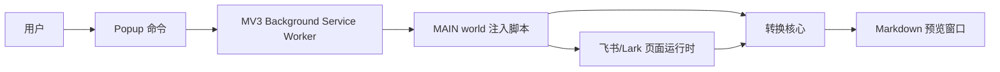
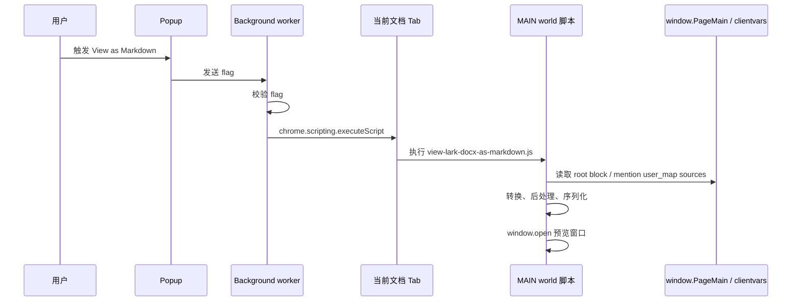
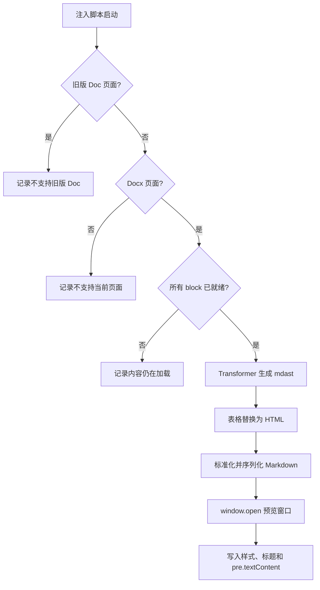

# Feishu Doc2Md 架构设计文档

最后更新：2026-06-12

## 1. 概览

Feishu Doc2Md 是一个 Chrome 扩展，用于把飞书/Lark Docx 文档预览为 Markdown。扩展完全在浏览器本地运行：用户在扩展 Popup 点击预览后，后台脚本把转换脚本注入到当前页面的 MAIN world；转换脚本读取页面暴露的 Docx 运行时数据，把 block tree 转换为 mdast，完成 mention 和表格后处理，再序列化为 Markdown，并打开一个轻量预览窗口。

当前仓库是 pnpm workspace + Turborepo 的单应用结构：

- 根工作区：维护统一脚本、依赖 catalog、Turborepo 任务和基础工具配置。
- `apps/chrome-extension`：维护扩展 manifest、Vue Popup、background script、注入脚本和 Docx 到 Markdown 的转换核心。

## 2. 设计目标

### 2.1 业务目标

- 在扩展 Popup 中提供单一、明确的 Markdown 预览入口。
- 不在文档页面注入额外按钮，也不注册页面右键菜单。
- 尽量保留文档结构，包括标题、段落、代码块、引用、列表、任务列表、表格、图片、iframe、行内样式、行内数学公式和部分 ISV 块。
- 转换过程在用户浏览器本地完成，不把文档内容上传到项目自有服务。

### 2.2 技术目标

- 扩展编排逻辑与核心转换逻辑分离。
- 使用本地维护的 Lark block 类型和 mdast 作为转换中间表示。
- 运行时适配层保持轻量，只访问 `window.PageMain`、`window.editor`、`window.DATA.clientVars.data` 和 `window.docxClientvarFetchManager._clientvarMap`。
- 在单 package 内同时构建 background、注入脚本和 Vue Popup。
- 构建时根据 package version 生成最终扩展 manifest。

### 2.3 非目标

- 不保证覆盖所有飞书/Lark 私有 block 类型。
- 不支持旧版飞书 Doc 1.0 页面转换，只做识别和拒绝。

## 3. 仓库结构

```text
.
├── package.json
├── pnpm-workspace.yaml
├── turbo.json
├── eslint.config.js
├── tsconfig.json
├── docs/
│   └── architecture-design.md
└── apps/
    └── chrome-extension/
        ├── manifest.json
        ├── package.json
        ├── popup.html
        ├── scripts/
        │   └── cli.ts
        ├── src/
        │   ├── background.ts
        │   ├── core/
        │   ├── pages/
        │   └── scripts/
        ├── images/
        ├── public/
        ├── design/
        ├── tsconfig*.json
        ├── tsdown.config.ts
        └── vite.config.ts
```

| 区域 | 路径 | 职责 |
| --- | --- | --- |
| 根工作区 | `package.json`, `pnpm-workspace.yaml`, `turbo.json` | 工作区脚本、依赖 catalog、Turborepo 任务 |
| 扩展应用 | `apps/chrome-extension` | Manifest V3 扩展包和所有运行时代码、构建代码 |
| Popup UI | `src/pages/popup`, `popup.html` | Vue Popup 命令菜单和主题初始化 |
| 扩展脚本 | `src/background.ts` | MV3 background service worker |
| 注入脚本 | `src/scripts/*.ts` | 注入到页面 MAIN world 执行的功能脚本 |
| 转换核心 | `src/core` | Lark 运行时适配、block 类型、Transformer、Markdown 序列化、mention/table 后处理 |
| 构建工具 | `scripts/cli.ts`, `tsdown.config.ts`, `vite.config.ts` | 扩展脚本、页面、资源和 manifest 的构建流程 |

## 4. 总体架构



系统运行时分为四层：

1. 扩展声明层：`manifest.json` 声明权限、匹配域名、background worker 和 Popup。
2. 用户交互层：Popup 产生预览动作 flag。
3. 执行编排层：background worker 校验动作 flag，并向当前 Tab 的 MAIN world 注入对应脚本。
4. 转换核心层：注入脚本使用 `src/core` 读取页面运行时、构建 mdast、执行后处理、序列化 Markdown 并打开预览窗口。

## 5. 浏览器扩展运行时

### 5.1 Manifest

源码：`apps/chrome-extension/manifest.json`

当前源码 manifest 使用 Manifest V3，定义了：

- 扩展名称：`Feishu Doc2Md`。
- Popup 入口：`pages/popup.html`。
- Background worker：`bundles/background.js`，类型为 `module`。
- 权限：`activeTab`、`scripting`。
- 不声明持久 `host_permissions`；用户点击扩展 Popup 时通过 `activeTab` 获取当前活动标签页的临时注入权限。

构建流程会把源码 manifest 复制到 `dist/manifest.json`，再从 `apps/chrome-extension/package.json` 写入 `version`。

### 5.2 Background Service Worker

源码：`apps/chrome-extension/src/background.ts`

主要职责：

- 处理 Popup 发送的 runtime message。
- 校验消息 flag 是否为预览动作。
- 查询当前窗口的 active tab。
- 调用 `chrome.scripting.executeScript` 注入脚本。
- 使用 `world: 'MAIN'`，让注入脚本能够访问页面自己的全局对象，例如 `window.PageMain`。

当前只有一个可执行动作：

| Flag | 注入脚本 |
| --- | --- |
| `view_docx_as_markdown` | `bundles/scripts/view-lark-docx-as-markdown.js` |

### 5.3 Popup 页面

相关文件：

- `apps/chrome-extension/popup.html`
- `apps/chrome-extension/src/pages/popup/main.ts`
- `apps/chrome-extension/src/pages/popup/popup.vue`
- `apps/chrome-extension/src/pages/shared/shared.css`
- `apps/chrome-extension/src/pages/popup/main.css`

Popup 是一个很小的 Vue 命令菜单，目前只有一个 `View as Markdown` 按钮。生产环境中点击按钮会发送 runtime message；开发环境中只输出调试日志，不调用 Chrome runtime API。

Popup 主题是本地逻辑：

- `main.ts` 监听 `prefers-color-scheme: dark`。
- 根据系统深色模式切换 `document.documentElement` 上的 `dark` class。
- `shared.css` 定义 Tailwind v4 light/dark 主题 token。

当前没有 Options 页面，也没有基于 `chrome.storage` 的设置模型。

## 6. 运行时通信



关键边界：

- Popup 运行在扩展上下文。
- 转换脚本运行在页面 MAIN world。
- 转换脚本可以访问页面全局对象，但不应依赖扩展上下文专属 API。

## 7. 转换核心

核心导出入口：`apps/chrome-extension/src/core/index.ts`

当前导出内容包括：

- Lark block 类型和页面运行时 helpers。
- `Docx` 门面类和 `docx` 单例。
- Markdown 标准化与序列化 helpers。
- table 转 HTML 后处理。
- mdast/hast 类型。

### 7.1 Lark 页面模型与运行时适配

源码：`apps/chrome-extension/src/core/lark.ts`

`lark.ts` 维护转换器当前需要的 Feishu/Lark Docx block 子集，并同时暴露页面全局对象的最小 typed view。把这两部分放在同一模块，是因为 `window.PageMain` 暴露的是 Lark 页面内的 root block tree，`window.DATA.clientVars.data` 和 `window.docxClientvarFetchManager._clientvarMap` 暴露了 mention 所需的用户映射和 block_map，本质上都属于 Lark 页面模型边界。

- `PageMain`：`window.PageMain` 的类型定义。
- `getPageMain()`：读取当前页面上的 `window.PageMain`。
- `isDocx()`：`window.PageMain` 存在时认为是新版 Docx 页面。
- `isDoc()`：`window.editor` 存在时认为是旧版 Doc 页面。
- `getRootBlock()`：读取 `PageMain.blockManager.rootBlockModel`。
- `getClientVarsDataSources()`：按优先级返回 `window.DATA.clientVars.data`，再返回 `window.docxClientvarFetchManager._clientvarMap` 中每个 value 的 `data`。
- `getMentionUserName()`：在上述所有 `user_map` 中按顺序查找 mention 用户 uid 对应的 `name`。
- `user_map`：mention 用户 uid 到用户信息的映射；行内转换阶段读取其中的 `name`，主 `DATA` 映射缺失时使用 fetch manager 中的映射兜底。
- `block_map`：页面 block 数据映射；`recordId` 是 block 回到 `block_map` 的关联键。主 `DATA` 映射可能只包含部分 record，`window.docxClientvarFetchManager._clientvarMap` 的 value data 里可能包含主映射缺失的 record。存在对应 entry 时，`block.snapshot` 与 `block_map[block.recordId].data` 结构等价，但不总是同一个对象引用。

### 7.2 Docx 门面

源码：`apps/chrome-extension/src/core/docx.ts`

`Docx` 负责收口运行时检测和转换入口：

- `isDocx`：判断当前页面是否为支持的 Docx 页面。
- `isDoc`：当不是 Docx 时，判断是否为旧版 Doc 页面。
- `rootBlock`：读取 `PageMain` 中的 root block。
- `isReady()`：递归检查 block 是否仍为 `pending`，以及 synced reference 是否加载完成。
- `intoMarkdownAST()`：创建 `Transformer`，把 root block 转为 mdast。

当 root block 不存在时，转换会返回空 mdast root。

### 7.3 Lark Block 类型模型

源码：`apps/chrome-extension/src/core/lark.ts`

该文件维护转换器当前需要的 Feishu/Lark Docx block 子集：

- 通用 block 字段：`type`、`recordId`、`snapshot`、`zoneState`、`children`。
- 行内文本 operation 和 attributes。
- 页面运行时对象：`PageMain`、`DATA`、`getPageMain()`、`getRootBlock()`。
- 结构块：page、heading、text、divider、code、quote、callout、list、todo、table、grid。
- 媒体和嵌入块：image、iframe、ISV、whiteboard、diagram、view、file。
- 同步块：`SYNCED_SOURCE`、`SYNCED_REFERENCE`。
- 明确建模但当前跳过的 unsupported block union。

这个类型文件是转换器内部模型，不试图成为完整的飞书/Lark SDK。

### 7.4 Transformer

源码：`apps/chrome-extension/src/core/transformer.ts`

`Transformer` 把 Docx block tree 转为 mdast，同时收集表格 HTML 后处理所需的信息。

内部状态：

- `parent`：当前 mdast 父节点，用于图片包裹、表格替换等上下文判断。
- `tableWithParents`：后续要替换为 HTML 的 table 节点及其父节点。
- `sequences`：标题自动编号状态。

子节点转换前，`flattenChildren()` 会先做结构归一化：

- `GRID` 通过列 children 扁平化。
- text container 的子文本块会提升到父文本块后方。
- `SYNCED_SOURCE` 直接展开 children。
- `SYNCED_REFERENCE` 优先使用 `innerBlockManager.rootBlockModel.children`。

Block 映射：

| 飞书/Lark block | mdast / Markdown 输出 |
| --- | --- |
| `PAGE` | `root` |
| `DIVIDER` | `thematicBreak` |
| `HEADING1` 至 `HEADING6` | `heading`，支持已有自动编号逻辑 |
| `HEADING7` 至 `HEADING9` | `paragraph` |
| `TEXT` | `paragraph` |
| `CODE` | fenced `code`，语言名转小写 |
| `QUOTE_CONTAINER`, `CALLOUT` | `blockquote` |
| `BULLET` | `listItem`，之后合并为无序 `list` |
| `ORDERED` | 带序号数据的 `listItem`，之后合并为有序 `list` |
| `TODO` | 带 checked 状态的 `listItem`，之后合并为任务列表 |
| `IMAGE` | `image`，非 table cell 内会包一层 paragraph |
| `TABLE` | mdast `table`，后续替换为 HTML |
| `GRID` | mdast `table`，后续替换为带百分比宽度的 HTML |
| `CELL`, `GRID_COLUMN` | `tableCell` |
| `IFRAME` | raw HTML iframe |
| `ISV` 文本绘图 | Mermaid `code` block |
| `ISV` 时间线 | 生成 Mermaid timeline `code` block |
| `WHITEBOARD`, `DIAGRAM`, `VIEW`, `FILE` | 跳过 |
| 其他 unsupported blocks | 跳过 |

root、blockquote、list item 的 children 会过滤成 mdast 允许的内容。连续 list item 由 `list.ts` 合并为真正的 mdast list。

### 7.5 行内转换

源码：`apps/chrome-extension/src/core/inline.ts`

行内转换读取 `block.zoneState.content.ops`。

当前支持：

- 普通文本。
- `italic` -> `emphasis`。
- `bold` -> `strong`。
- `strikethrough` -> `delete`。
- `link` -> 解码 URL 后生成 `link`。
- `inlineCode` -> `inlineCode`。
- `equation` -> `inlineMath`。
- `underline` -> raw HTML `<u>`。
- `inline-component` mention doc -> 链接到引用文档。
- `inline-component` user -> 从 clientvars data sources 的 `user_map[uid]?.name` 读取展示名，生成 `@name` 文本；找不到名称时生成 `@uid`。

带 `fixEnter` 的 operation 会被忽略。必要时会裁掉尾部换行，并合并相邻兼容的 phrasing 节点，减少 Markdown 噪音。

### 7.6 列表合并

源码：`apps/chrome-extension/src/core/list.ts`

Transformer 初始输出 list item，`mergeListItems()` 再把相邻且兼容的 list item 合并为 mdast `list`。

规则：

- Todo item 只与 todo item 合并。
- Bullet item 只与 bullet item 合并。
- Ordered item 在序号相邻或使用 auto 编号时合并。
- 数字序号会写入 Markdown list 的 `start`。

该模块只处理 mdast list item 结构，不依赖 Lark block 类型。

### 7.7 嵌入内容

源码：`apps/chrome-extension/src/core/embeds.ts`

嵌入辅助函数包括：

- `imageToMarkdownImage()`：从图片 token 和 caption 生成 mdast image。
- `iframeToHtml()`：URL 存在时生成带 sandbox 的 `<iframe>` HTML；缺省高度为 `400`。
- `generateMermaidTimeline()`：把支持的 ISV timeline items 转为 Mermaid timeline 语法。

图片 URL 当前直接使用页面提供的 image token。

### 7.8 Mention 解析

源码：`apps/chrome-extension/src/core/inline.ts`

用户 mention 在行内转换时直接解析，展示名称来自当前页面运行时的 clientvars data sources：

1. 行内转换解析 `inline-component`。
2. 当组件类型为 `user` 时读取组件里的 `uid`。
3. 先查 `window.DATA.clientVars.data.user_map[uid]?.name`。
4. 如果主映射没有命中，再按顺序查 `window.docxClientvarFetchManager._clientvarMap` 中每个 value 的 `data.user_map[uid]?.name`。
5. 找到名称后生成 `@${name}` 文本，找不到名称时生成 `@${uid}`。

如果所有 `user_map` 都没有对应用户名称，该 mention 会保留 uid，避免内容静默丢失。

### 7.9 表格 HTML 后处理

源码：`apps/chrome-extension/src/core/table-html.ts`

当前所有 table 都会在 mdast 构建后转换为 HTML。

原因：

- 飞书/Lark 表格可能包含 row/column span。
- 部分单元格包含无法用 GFM table phrasing content 表达的 block 内容。
- Grid 需要保留列宽比例。

处理流程：

1. Transformer 记录每个 mdast `table` 及其 parent。
2. `replaceInvalidTableChildren()` 恢复被标记为 `invalidChildren` 的复杂单元格内容。
3. `processTableSpans()` 删除被 span 覆盖的冗余 cell，并写入 `rowSpan` / `colSpan` HTML 属性。
4. 使用 `mdast-util-to-hast` 把 table 转为 hast。
5. 如果存在列宽，插入 `colgroup`。
6. 使用 `hast-util-to-html` 序列化。
7. 用 raw HTML node 替换父节点中的原始 mdast table。

该模块只消费 Transformer 写入 mdast table `data` 的表格元数据，不直接依赖 Lark block 类型。

### 7.10 Markdown 标准化与序列化

源码：`apps/chrome-extension/src/core/markdown.ts`

Markdown 标准化与序列化使用：

- `mdast-util-to-markdown`：把 mdast 转为 Markdown 字符串。
- `mdast-util-from-markdown`：把 Markdown 字符串重新解析为 mdast。

`normalizeMarkdown(root: mdast.Root)` 会先使用默认 Markdown 序列化配置执行一次 `toMarkdown()`，再对得到的 Markdown 字符串执行 `fromMarkdown()`，生成标准化后的 mdast root。

默认启用的 Markdown 方言能力包括：

- GFM strikethrough。
- GFM task list item。
- math 序列化，`singleDollarTextMath: false`。

`fromMarkdown()` 配置了对应的 micromark 和 mdast 扩展，避免标准化过程丢失删除线、任务列表和数学公式结构。

`stringifyMarkdown()` 会在最终输出 Markdown 前调用 `normalizeMarkdown()`，并通过 `console.error` 分别记录原始 mdast root 字符串和标准化后的 mdast root 字符串，方便后续比较结构差异。当前项目没有动态序列化选项，`toMarkdown()` 使用固定配置常量。

该模块也集中维护 mdast 内容类型谓词，例如 root、blockquote/list item、phrasing content 和 table cell 的类型收窄，供 Transformer 在构造 AST 时过滤合法 child。

### 7.11 内部通用工具

源码：`apps/chrome-extension/src/core/utils.ts`

`utils.ts` 只放跨多个 core 模块复用、且不属于 Lark、Markdown、table、inline 等领域边界的低层 helper。当前只有 `trimTrailingLineBreak()`，供行内公式、代码块和图片 caption 处理复用。

## 8. 预览流程

入口脚本：`apps/chrome-extension/src/scripts/view-lark-docx-as-markdown.ts`



错误处理保持简单：当前不会创建用户可见错误 UI，只通过 `console.error` 输出带 `[Feishu Doc2Md]` 前缀的错误信息。

预览窗口把 Markdown 作为纯文本写入 `<pre>`，使用 `textContent`，因此生成的 Markdown 不会在预览窗口中被当作 HTML 执行。

## 9. 构建架构

### 9.1 根脚本

根 `package.json` 暴露：

| Script | 说明 |
| --- | --- |
| `pnpm run watch` | `turbo watch build` |
| `pnpm run build` | `turbo run build` |
| `pnpm run type-check` | `turbo run type-check` |
| `pnpm run lint` | `eslint .` |
| `pnpm run format-check` | Prettier 检查 |
| `pnpm run format` | Prettier 写入 |
| `pnpm run prepare` | Husky 初始化 |

根 package 为 private，名称是 `feishu-doc2md`。扩展 package 是 `@feishu-doc2md/chrome-extension`，版本号为 `1.0.0`。

### 9.2 Turborepo

源码：`turbo.json`

任务：

- `build`：缓存 `dist/**`，并把源码、构建脚本、图标、manifest、popup HTML、TS 配置和 workspace lock/config 作为输入。
- `type-check`：委托 package 内部的类型检查任务。

当前 Turborepo 作用域里只有 `apps/chrome-extension`。

### 9.3 扩展构建 CLI

源码：`apps/chrome-extension/scripts/cli.ts`

扩展 package 的 `build` 脚本执行：

```shell
node --experimental-strip-types ./scripts/cli.ts build
```

构建步骤：

1. `cleanDist()`：删除旧的 `dist/`，避免删除源码资源后旧产物残留。
2. `buildScripts()`：使用 tsdown 构建 background 和注入脚本。
3. `buildPages()`：使用 rolldown-vite 构建 Vue Popup 页面。
4. `copyStaticAssets()`：复制 `images/` 到 `dist/images/`。
5. `writeManifest()`：读取源码 `manifest.json`，写入 package version；如果 target 是 Firefox，则把 service worker background 改写为 Firefox 需要的 scripts 形式，并声明不收集数据。
6. 仅 Firefox target 会额外对 `dist/` 执行 `web-ext lint`。

CLI 参数：

| 参数 | 说明 |
| --- | --- |
| `--release`, `-r` | release 模式，输出更紧凑、启用优化 |
| `--target <target>` | 默认为 `chromium`，也支持 `firefox` |

### 9.4 脚本打包

源码：`apps/chrome-extension/tsdown.config.ts`

脚本产物：

| Entry | Format | Output |
| --- | --- | --- |
| `src/background.ts` | ESM | `dist/bundles/background.js` |
| `src/scripts/*.ts` | IIFE | `dist/bundles/scripts/*.js` |

关键配置：

- browser platform。
- ES2024 target。
- `@` alias 指向 `src`。
- package dependencies 通过 `noExternal` 打入 bundle。
- 开发构建不 minify，release 构建 minify。

### 9.5 Popup 页面打包

源码：`apps/chrome-extension/vite.config.ts`

Vite/Rolldown 配置：

- base path：`/pages/`。
- 插件：Vue、Tailwind CSS。
- HTML 入口：`popup.html`。
- 输出目录：`dist/pages`。
- `@` alias 指向 `src`。
- 非 release 模式下追加 `dev` resolve condition。

### 9.6 TypeScript 边界

扩展 package 使用多个 TypeScript project：

| Config | Scope |
| --- | --- |
| `tsconfig.base.json` | 共享 strict compiler options |
| `tsconfig.node.json` | 构建脚本和 bundler 配置 |
| `tsconfig.extension.json` | Background script 和共享 core 类型 |
| `tsconfig.web.json` | 注入脚本和共享 core 类型 |
| `tsconfig.pages.json` | Vue 页面、DOM 和 Vite client 类型 |
| `tsconfig.json` | package 级 composite reference root |

根 `tsconfig.json` 只覆盖根级工具代码，例如 `eslint.config.js`。

## 10. 依赖模型

依赖版本集中在 `pnpm-workspace.yaml` 的 catalogs 中维护。

主要依赖组：

- `build`：`rolldown-vite`、`tsdown`。
- `dev`：Vue/Vite/Tailwind/TypeScript 辅助包。
- `lint`：ESLint、Prettier、Husky、lint-staged、typescript-eslint。
- `markdown`：`mdast-util-from-markdown`、`mdast-util-to-markdown`、Markdown 解析扩展。
- `monorepo`：Turborepo。
- `node`：构建期 Node 工具，例如 `execa`、`glob`。
- `prod`：运行时转换和 UI 依赖。
- `tools`：`vue-tsc`、`web-ext`。
- `types`：共享类型包。

仓库清理后不再包含 Changesets 依赖。

## 11. 数据与隐私边界

- 转换在用户浏览器当前文档页面内执行。
- 项目不定义自有后端。
- core 从 `window.PageMain` 读取文档结构，从 `window.DATA.clientVars.data.user_map` 和 `window.docxClientvarFetchManager._clientvarMap` 读取 mention 用户展示名。
- Markdown 转换阶段会在当前页面 console 输出原始和标准化后的 mdast root 字符串，调试日志可能包含文档文本。
- 图片 URL 使用飞书/Lark image token 输出，项目自身不抓取也不上传图片。
- 扩展不申请持久站点权限；只有用户点击扩展 Popup 后，`activeTab` 才授予当前活动标签页的临时脚本注入权限。
- 错误日志应避免加入私有文档内容，当前实现只输出通用错误信息。

## 12. 当前限制

- 转换器依赖 `window.PageMain`、clientvars data sources、block snapshot 等页面私有实现。
- 不支持或不稳定的 block 类型会被跳过，而不是输出占位内容。
- 表格统一转 raw HTML，比 GFM table 更保真，但在禁用 HTML 的 Markdown 渲染器中可移植性较弱。
- mention 解析优先依赖 clientvars data sources 中的 `user_map`；如果所有运行时用户映射都缺失，该 mention 会 fallback 为 uid。
- 预览窗口展示的是 Markdown 纯文本，不是渲染后的 Markdown 页面。
- Firefox 支持通过构建阶段适配，但源码 manifest 仍以 Chromium MV3 形态为主。

## 13. 演进建议

后续可以考虑：

1. 把页面运行时兼容检查进一步集中，降低飞书/Lark 页面改版影响。
2. 为 `Transformer`、行内转换、列表合并、表格 HTML 替换和 mention fallback 增加 focused fixtures。
3. 为不支持页面和内容未加载完成的情况增加用户可见反馈。
4. 增加可选的渲染态 Markdown 预览，同时保留当前安全的纯文本预览。
5. 持续验证 Firefox target 下 background 适配和 `window.open` 行为差异。
