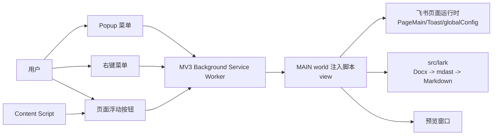
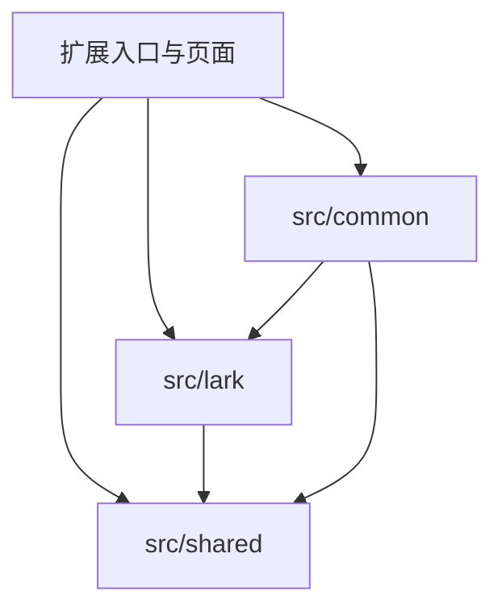
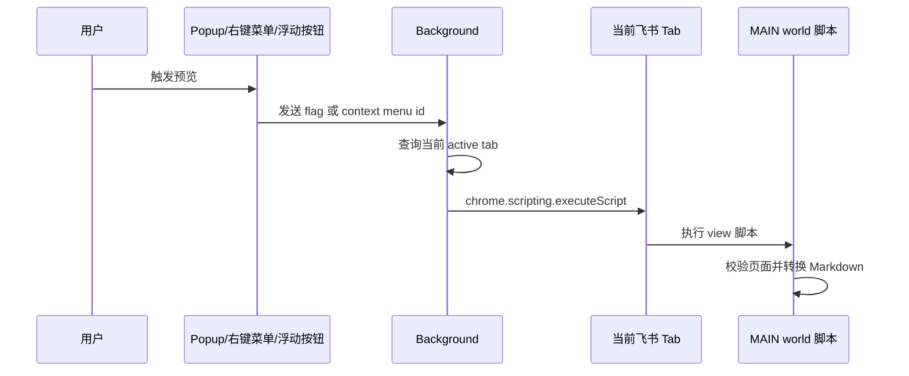

# Cloud Document Converter 架构设计文档

最后更新：2026-06-11

## 1. 背景

Cloud Document Converter 是一个 Chrome Extension，用于在飞书/Lark 云文档页面中把 Docx 文档转换为 Markdown，并在新窗口中预览 Markdown。项目采用 pnpm workspace + Turborepo 的单应用结构，浏览器扩展、核心转换引擎和公共工具统一收敛在 `apps/chrome-extension` 一个 package 内。

## 2. 设计目标

### 2.1 业务目标

- 在飞书/Lark Docx 页面内提供低摩擦的 Markdown 预览能力。
- 支持用户把当前 Docx 文档转换为 Markdown 并在新窗口中查看。
- 尽量保留文档结构，包括标题层级、列表、任务列表、表格、图片、iframe、内联样式和部分 ISV 块。
- 使用固定内置转换策略：主题跟随系统，表格统一转 HTML，Grid 子块扁平化，文本高亮始终保留。

### 2.2 技术目标

- 核心转换逻辑与扩展 UI 在源码层解耦，便于维护和局部演进。
- 运行时依赖浏览器扩展权限，但转换逻辑尽量只依赖飞书页面暴露的运行时对象。
- 支持 Manifest V3 的 Chrome 扩展运行模型，同时保留 Firefox 构建适配入口。
- 使用 AST 作为中间表示，降低 Markdown 字符串拼接带来的格式风险。

### 2.3 非目标

- 不实现独立后端服务，转换过程在浏览器本地完成。
- 不支持旧版飞书 Doc 1.0 页面转换，当前只支持 Docx。
- 不保证覆盖所有飞书私有块类型，无法识别或不稳定的块会被跳过或降级处理。

## 3. 总体架构

系统由五个主要层次组成：

1. 扩展入口层：`manifest.json` 声明权限、页面、content script 和 background service worker。
2. 用户交互层：Popup、右键菜单、飞书页面浮动按钮。
3. 执行编排层：Background 根据用户动作向当前 Tab 注入具体功能脚本。
4. 转换引擎层：`apps/chrome-extension/src/lark` 从飞书页面运行时读取 Docx block tree，转换为 mdast，再序列化为 Markdown。
5. 公共基础设施层：`apps/chrome-extension/src/shared` 提供等待、时间常量和 DOM 轮询工具。

## 4. 单包模块划分

| 模块 | 路径 | 职责 |
| --- | --- | --- |
| 根工作区 | `package.json`, `pnpm-workspace.yaml`, `turbo.json` | 统一脚本、依赖目录、Turborepo 任务缓存 |
| Chrome Extension package | `apps/chrome-extension` | MV3 扩展应用、Vue 页面、content/background/injected scripts、扩展构建 |
| Lark 转换模块 | `apps/chrome-extension/src/lark` | 飞书 Docx block 模型适配、mdast 转换、Markdown 序列化、图片 token URL 映射 |
| Shared 工具模块 | `apps/chrome-extension/src/shared` | 应用内部通用工具、时间常量、DOM 轮询工具 |
| 扩展业务公共模块 | `apps/chrome-extension/src/common` | 错误上报、表格 HTML 后处理、扩展消息枚举 |
| TS 配置 | `apps/chrome-extension/tsconfig*.json`, 根 `tsconfig.json` | 应用与根工具脚本的 TypeScript 配置 |
| 版本变更 | `.changeset` | 扩展 package 发布变更记录 |

源码依赖方向保持为入口层依赖内部模块：

## 5. 浏览器扩展架构

### 5.1 Manifest 与权限

`apps/chrome-extension/manifest.json` 使用 Manifest V3：

- `action.default_popup` 指向 `pages/popup.html`。
- `background.service_worker` 指向 `bundles/background.js`。
- `content_scripts` 在飞书/Lark 相关域名下加载 `bundles/content.js`。
- 权限包括 `contextMenus`、`scripting`。
- host permissions 限定在 `feishu.cn`、`feishu.net`、`larksuite.com`、`feishu-pre.net`、`larkoffice.com`、`larkenterprise.com` 等域名。

### 5.2 Background Service Worker

入口：`apps/chrome-extension/src/background.ts`

主要职责：

- 在扩展安装时注册“查看 Markdown”右键菜单。
- 接收右键菜单点击事件，根据菜单 ID 注入对应脚本。
- 接收 Popup 或页面浮动按钮发来的 `chrome.runtime.sendMessage`，查询当前激活 Tab 并注入对应脚本。
- 通过 `chrome.scripting.executeScript` 把功能脚本注入到 `world: 'MAIN'`，让脚本可以访问飞书页面暴露在主世界的运行时对象。

### 5.3 Content Script

入口：`apps/chrome-extension/src/content.ts`

主要职责：

- 在飞书 Docx 页面上渲染固定定位的预览按钮。
- 监听飞书页面 DOM 变化，等待页面右侧帮助/评论按钮等锚点出现后计算按钮位置。
- 监听 SPA 路由切换，清理旧按钮并重新初始化。
- 不负责设置读取；转换脚本使用固定内置转换策略。

### 5.4 Popup 页面

入口：`apps/chrome-extension/src/pages/popup/popup.vue`

Popup 是轻量命令菜单，仅包含：

- 查看 Markdown

在生产环境中，操作项通过 `chrome.runtime.sendMessage({ flag })` 交给 background 注入脚本；在开发环境中输出调试日志。

### 5.5 固定策略

项目不再提供 Options 页面，也不再从 `chrome.storage.sync` 读取设置。转换流程直接内联固定策略，不再保留设置模型。

## 6. 运行时通信设计

### 6.1 用户动作到脚本注入

### 6.2 固定策略

MAIN world 注入脚本不再通过 Content script 桥接读取扩展设置。预览脚本直接执行固定转换流程，避免引入 `storage` 权限、跨 world 设置协议和设置分支。

## 7. Markdown 转换架构

核心入口：`apps/chrome-extension/src/lark/docx.ts`

### 7.1 页面运行时适配

`apps/chrome-extension/src/lark/env.ts` 从当前页面读取飞书运行时对象：

- `window.PageMain`：Docx block tree、定位 block 的能力。
- `window.Toast`：复用飞书页面 Toast UI。
- `window.editor`：用于判断旧版 Doc 页面。

`Docx` 类对页面能力做统一封装：

- `isDocx`：当前页面是否是新版 Docx。
- `isDoc`：是否是旧版 Doc。
- `rootBlock`：读取 `PageMain.blockManager.rootBlockModel`。
- `pageTitle`：从 root block 文本推导文件名。
- `isReady`：判断 block 是否仍为 pending，以及 synced reference 是否准备完成。
- `scrollTo`：滚动飞书文档容器，用于触发懒加载。
- `intoMarkdownAST`：把飞书 block tree 转换成 mdast。
- `Docx.stringify`：使用 `mdast-util-to-markdown` 输出 Markdown，并启用 GFM 删除线、任务列表和数学表达式扩展。

### 7.2 Transformer

`Transformer` 负责把飞书 block 转换成 mdast 节点。它维护以下转换过程状态：

- `parent`：当前 mdast 父节点，用于决定图片是否包裹 paragraph、表格替换位置等。
- `mentionUsers`：待二次解析的用户 mention。
- `tableWithParents`：待统一转 HTML 的 table 节点及其父节点。
- `sequences`：标题自动编号状态。

主要 block 映射：

| 飞书 BlockType | Markdown/mdast 输出 |
| --- | --- |
| `PAGE` | `root` |
| `HEADING1` 至 `HEADING6` | `heading`，保留深度和自动编号 |
| `HEADING7` 至 `HEADING9`, `TEXT` | `paragraph` |
| `CODE` | fenced code block |
| `BULLET`, `ORDERED`, `TODO` | `listItem`，随后合并为 `list` |
| `QUOTE_CONTAINER`, `CALLOUT` | `blockquote` |
| `DIVIDER` | thematic break |
| `IMAGE` | `image`，URL 使用图片 token |
| `WHITEBOARD`, `DIAGRAM`, `FILE` | 跳过 |
| `TABLE` | `table`，记录列宽、合并单元格和异常子节点 |
| `GRID` | 扁平化为子块 |
| `IFRAME` | HTML iframe |
| `ISV` 文本绘图/时间线 | Mermaid code block |
| 不支持块 | 跳过或降级 |

### 7.3 Inline 内容转换

飞书文本使用 operation/attribute 结构。转换时会处理：

- 普通文本。
- 加粗、斜体、删除线、下划线。
- 行内代码。
- 数学公式。
- 链接。
- 文本高亮，始终保留为 HTML。
- mention 用户，先转换为占位 inlineCode，后续定位页面 DOM 解析为 `@用户名`。
- mention doc 等 inline component。

### 7.4 表格与 Grid 后处理

扩展层在 `apps/chrome-extension/src/common/utils.ts` 执行固定后处理：

- Grid 在 Transformer 中直接扁平化为子块。
- 所有 table 统一转 HTML。
- 包含非 phrasing 内容的复杂表格会先用 `invalidChildren` 替换单元格内容，再转 HTML。
- 表格转 HTML 时会处理 `rowSpan`、`colSpan` 和 `colgroup`，避免 GFM 表格无法表达复杂结构。

## 8. 核心业务流程

### 8.1 预览 Markdown

入口：`apps/chrome-extension/src/scripts/view-lark-docx-as-markdown.ts`

流程：

1. 校验当前页面是 Docx，且文档内容已加载完成。
2. 调用 `docx.intoMarkdownAST` 生成 mdast，过程中固定保留文本高亮并扁平化 Grid。
3. 解析 mention 用户。
4. 将所有 table 转 HTML。
5. `Docx.stringify(root)` 输出 Markdown。
6. 使用 `window.open` 创建新窗口，将 Markdown 写入 `pre` 并注入简单样式。
7. 用 Toast 提示失败或可上报错误。

## 9. 资源访问设计

### 9.1 图片

图片 block 在转换为 mdast `image` 时直接把飞书图片 token 写入 `url`，不再生成外链，也不再进行额外资源生效请求。

白板、图表和附件不再在预览流程中转换为本地资源或访问链接。

## 10. 固定策略与主题

### 10.1 转换策略

设置模型已删除。当前固定策略为：

- 主题跟随系统深浅色。
- 所有表格转 HTML。
- Grid 子块扁平化。
- 文本高亮始终保留。

### 10.2 主题

Popup 直接根据 `prefers-color-scheme` 初始化主题并监听系统主题变化。主题不再保存到 storage。

## 11. 构建架构

扩展构建入口：`apps/chrome-extension/scripts/cli.ts`

构建过程分为四步：

1. `buildScripts`：使用 tsdown 构建 background、content 和功能脚本。
2. `buildPages`：使用 rolldown-vite 构建 Popup Vue 页面。
3. `copyResources`：复制 `images`、`manifest.json`。
4. `genManifest`：写入 package version，并在 Firefox target 下把 MV3 service worker background 转为 Firefox 需要的 scripts 形式。

`apps/chrome-extension/tsdown.config.ts` 的关键策略：

- `background.ts` 构建为 ESM，输出到 `dist/bundles/background.js`。
- `content.ts` 和 `src/scripts/*.ts` 构建为 IIFE，输出到 `dist/bundles/`。
- `platform: 'browser'`，`target: es2024`。
- release 模式开启 minify 和 Babel runtime。
- 本地 Lark 与 shared 模块通过源码相对路径参与同一次脚本构建，不再依赖旧多包架构的 `dev` condition。

`apps/chrome-extension/vite.config.ts` 的关键策略：

- `base: '/pages/'`。
- 单入口构建 `popup.html`。
- 页面产物输出到 `dist/pages`。
- 使用 Vue 和 Tailwind Vite 插件。

Turborepo 根任务：

- `build` 直接构建扩展 package，输出缓存 `dist/**`。
- `type-check` 直接执行扩展 package 的类型检查。

## 12. 安全与隐私设计

- 所有转换在浏览器本地执行，不引入项目自有后端。
- host permissions 限定在飞书/Lark 相关域名，减少扩展可访问范围。
- 文档调试输出应避免包含私有文档内容、token、cookie。

## 13. 主要架构风险

| 风险 | 影响 | 应对建议 |
| --- | --- | --- |
| 依赖飞书页面私有运行时对象 | 飞书前端结构变更可能导致转换失效 | 为 `PageMain`、block schema、DOM selector 增加更明确的兼容层 |
| 复杂表格与 Grid 无法完全用 GFM 表达 | Markdown 输出可能丢结构 | 继续使用固定 HTML 降级与 Grid 扁平化策略 |
| 新窗口打开受用户激活限制 | 后台注入脚本可能无法打开预览窗口 | 保持预览动作直接由用户触发，并在失败时给出 Toast 提示 |

## 14. 演进建议

1. 抽象页面运行时适配层：把 `window.PageMain`、`window.globalConfig`、DOM selector 集中到独立 adapter，降低飞书改版影响面。
2. 收敛预览脚本中的页面校验、AST 转换、mention/table 后处理，让流程更容易复用。
3. 完善图片 token URL 在不同飞书/Lark 域名下的可访问性验证。
4. 完善浏览器兼容矩阵：持续验证 Chromium 与 Firefox target 的 manifest、background 和窗口打开行为差异。
