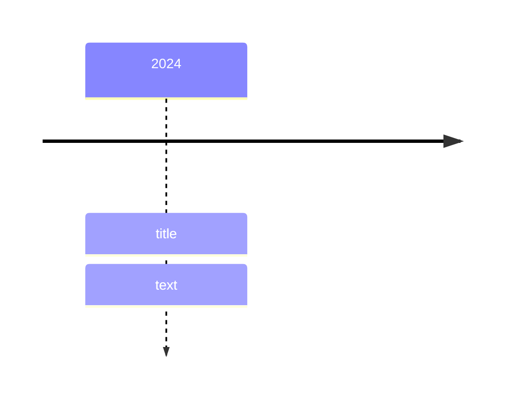

# 飞书 Docx 转 Markdown 转换设计与实现文档

最后更新：2026-06-22

## 1. 文档目标

本文描述一个可独立移植的 Feishu/Lark Docx 到 Markdown 转换模块设计。它不以当前仓库的实现代码为唯一准绳，而是从“输入的 Docx block tree 如何语义化转换为 mdast，再序列化为 Markdown”的角度，定义更清晰、更稳定的转换过程。

本文默认口径：

- Markdown AST 使用 mdast 作为核心中间表示。
- 表格、grid 布局统一输出 raw HTML table，不区分简单表格和复杂表格。
- 不支持或未知 block 需要在输入模型中保留最基本的定义和转换分支，但转换结果中跳过。
- `callout` 等同于 `blockquote` 降级处理，不保留图标、背景色等展示属性。
- 图片资源解析使用可插拔 resolver；默认可用飞书/Lark 图片 token 生成预览 URL。
- `synced_source` 与已加载的 `synced_reference` 展开为真实子内容；未加载内容由转换前 readiness 检查拦截。
- `heading7` 至 `heading9` 降级为普通段落。
- underline、iframe、表格等 Markdown 原生无法准确表达的内容允许输出 raw HTML。

本文适合给其它项目重写转换模块时参考。具体浏览器扩展、页面注入、预览窗口和构建流程不在本文展开，相关内容见 `docs/architecture-design.md`。

## 2. 总体转换模型

推荐把系统拆成三层：

1. **运行时适配层**：从飞书/Lark 页面、导出接口或其它数据源读取原始 block tree，并转换成稳定的内部输入模型。
2. **纯转换层**：只消费内部输入模型、mention resolver、image resolver 等依赖，把 block tree 转成 mdast root，并为 table/grid 直接生成 raw HTML。
3. **Markdown 序列化层**：把 mdast root 序列化为 Markdown，启用 GFM task list、GFM strikethrough、math、raw HTML 等必要扩展。

核心数据流：


转换层应尽量保持纯函数化：

```ts
interface ConvertOptions {
  resolveMentionUserName: (uid: string) => string | undefined
  resolveImageUrl: (token: string, image: ImageData) => string
}

interface ConvertResult {
  root: mdast.Root
}

function convertDocxBlockTree(root: PageBlock, options: ConvertOptions): ConvertResult
```

运行时对象、DOM、网络和日志不应渗入转换核心。这样其它项目可以从浏览器页面、离线 JSON、服务端 API 或测试 fixture 接入同一套转换逻辑。

## 3. 飞书 Docx 内部结构抽象

### 3.1 Block Tree

Docx 文档可抽象为一棵 block tree。根节点通常是 `page`，每个 block 表示一个结构单元，例如段落、标题、列表项、表格、单元格、图片等。

推荐内部模型保留以下通用字段：

```ts
interface Block {
  type: BlockType
  recordId: string
  snapshot: BlockSnapshot
  zoneState?: BlockZoneState
  children: Block[]
}
```

字段语义：

- `type`：block 的运行时类型。转换分支主要依赖它。
- `recordId`：block 在页面 `block_map` 中的稳定索引键。转换本身不一定需要它，但调试、补全 snapshot 和后续兼容很有价值。
- `snapshot`：block 的结构化数据。不同 block 类型拥有不同字段，例如表格列宽、单元格合并信息、图片 token、todo 完成状态等。
- `zoneState`：富文本内容状态，主要用于文本、标题、列表项、代码块。
- `children`：结构子节点。列表项、引用、表格、表格单元格、grid column、同步块等都通过它表达嵌套关系。

运行时中 `snapshot.type === 'pending'` 通常表示该 block 还未加载完成。转换前应先做 readiness 检查；转换阶段不应把 pending 内容静默转成空内容。

### 3.2 Page 与运行时数据源

在飞书/Lark 页面中，常见数据入口包括：

- `PageMain.blockManager.rootBlockModel`：当前文档页面的 root block。
- `DATA.clientVars.data.block_map`：block 数据映射。
- `DATA.clientVars.data.user_map`：mention 用户信息映射。
- `docxClientvarFetchManager._clientvarMap`：按需拉取的 clientvars 数据集合，可能包含主 `DATA` 中缺失的 block 或 user 信息。

独立实现时，不需要暴露这些页面私有对象。适配层只需把它们归并成：

```ts
interface ClientVarsData {
  block_map: Record<string, { data: BlockSnapshot } | undefined>
  user_map: Record<string, { name: string } | undefined>
}

interface RuntimeDocument {
  root: PageBlock
  dataSources: ClientVarsData[]
}
```

`dataSources` 应按优先级排列。mention 解析时先查主数据源，再查 fallback 数据源：

```ts
function resolveMentionUserName(uid: string, sources: ClientVarsData[]) {
  for (const source of sources) {
    const name = source.user_map[uid]?.name
    if (name) return name
  }
}
```

`recordId`、`block_map` 和 `snapshot` 的关系建议按以下方式理解：

- `block.recordId` 是 block 回到 `block_map` 的关联键。
- 当 `block_map[recordId]` 存在时，`block_map[recordId].data` 与 `block.snapshot` 通常结构等价。
- 主 `DATA.clientVars.data.block_map` 可能不完整，fallback data source 中可能包含主映射缺失的记录。
- 转换核心优先使用 block tree 上已经挂载的 `snapshot`；只有在适配层发现 snapshot 缺字段时，才用 `block_map` 补全。
- 转换核心不应在递归过程中反复查询页面运行时 block map；这会让转换依赖页面私有状态，降低可测试性。

### 3.3 ZoneState 与富文本 Operation

文本内容由 `zoneState` 表示：

```ts
interface BlockZoneState {
  allText: string
  content: {
    ops: Operation[]
  }
}

interface Operation {
  insert: string
  attributes: Attributes
}
```

`allText` 是 block 的纯文本聚合，适合代码块这种需要原样保留换行的场景。普通段落、标题、列表项则应读取 `content.ops`，因为 op 中携带了富文本属性。

常见 attributes：

```ts
interface Attributes {
  fixEnter?: string
  italic?: string
  bold?: string
  strikethrough?: string
  underline?: string
  inlineCode?: string
  equation?: string
  'inline-component'?: string
  link?: string
  'link-id'?: string
}
```

注意事项：

- 大多数样式属性应按“属性是否存在”判断，而不是按属性值真假判断。
- `fixEnter` 表示飞书用于块结尾的控制换行，转换时应忽略。
- 普通 `insert: '\n'` 且没有 `fixEnter` 的 op 表示段落内换行，应转为 mdast `break`。
- `inline-component` 是 JSON 字符串，可能表示用户 mention、文档 mention 或其它组件。

### 3.4 关键 Block 类型

转换模块至少应识别以下类型：

| 类型 | 语义 |
| --- | --- |
| `page` | 文档根节点 |
| `text` | 普通段落 |
| `heading1` 至 `heading9` | 标题；Markdown 原生只支持 1-6 |
| `divider` | 分割线 |
| `code` | 代码块 |
| `quote_container` | 引用容器 |
| `callout` | 提示块，降级为引用容器 |
| `bullet` | 无序列表项 |
| `ordered` | 有序列表项 |
| `todo` | 任务列表项 |
| `image` | 图片 |
| `table` | 表格 |
| `table_cell` | 表格单元格 |
| `grid` | 多列布局，输出为一行多列 HTML table |
| `grid_column` | grid 列 |
| `iframe` | 外部嵌入 |
| `isv` | 第三方/互动块，部分类型可降级 |
| `synced_source` | 同步块源内容，透明展开 |
| `synced_reference` | 同步块引用，加载完成后透明展开 |

还应保留已知但暂不支持的类型定义，例如 `bitable`、`chat_card`、`diagram`、`file`、`mindnote`、`sheet`、`view`、`whiteboard`、`fallback` 等。转换时显式分支返回 `null`，避免未来新增类型时误判为普通文本。

## 4. 转换前 readiness 检查

转换前应确认输入树已经稳定：

1. root block 存在。
2. 任意 block 的 `snapshot.type` 都不是 `pending`。
3. 任意 `synced_reference` 的 `isAllDataReady` 为 true。
4. 对 `synced_reference` 递归检查时，优先检查 `innerBlockManager.rootBlockModel.children`，缺失时再检查自身 `children`。

伪代码：

```ts
function isReady(block: Block): boolean {
  if (block.snapshot.type === 'pending') return false

  if (block.type === 'synced_reference' && !block.isAllDataReady) {
    return false
  }

  const children =
    block.type === 'synced_reference'
      ? block.innerBlockManager?.rootBlockModel?.children ?? block.children
      : block.children

  return children.every(isReady)
}
```

readiness 是转换前置条件。转换器本身可以假定输入不是 pending，从而保持逻辑简单。

## 5. 转换上下文与中间状态

递归转换时需要少量上下文：

```ts
interface TransformContext {
  parent: mdast.Parent | null
  headingSequences: Array<string | undefined>
  orderedListSequenceByParent: WeakMap<mdast.Parent, number>
  options: ConvertOptions
}
```

推荐状态职责：

- `parent`：记录当前普通 mdast 父节点，用于有序列表序号状态和 parent scope 恢复；表格/grid 单元格不依赖这个字段判断输出，而是走专用 HTML fragment renderer。
- `headingSequences`：维护自动标题编号。
- `orderedListSequenceByParent`：维护同一父容器下 ordered list 的推导序号。
- `options.resolveMentionUserName`：把用户 uid 转为展示名。
- `options.resolveImageUrl`：把图片 token 转为可访问 URL。

转换结果应先生成合法 mdast root。表格和 grid 因为最终总是 raw HTML，推荐走专用 Table IR 并直接返回 mdast `html` 节点，不再复用普通 mdast parent 的 children 收尾逻辑。

## 6. 子节点归一化

飞书 block tree 中有些节点是语义透明容器或展示布局容器。转换前需要对当前 block 的 children 做归一化。

### 6.1 文本容器子节点

`text` 和 `heading*` 可能既有自身 `zoneState`，又有 children。推荐语义是：

1. 当前文本容器先转换为自己的段落或标题。
2. children 作为后续同级块继续转换。

也就是说，文本容器的 children 不应塞进同一个 paragraph 内，否则会破坏块级结构。

### 6.2 同步块

`synced_source` 是透明容器，直接展开 `children`。

`synced_reference` 是同步块引用。加载完成后优先展开：

```ts
block.innerBlockManager?.rootBlockModel?.children ?? block.children
```

转换时不输出“同步块”外壳。这样 Markdown 表达的是用户看到的实际内容。

### 6.3 Grid

`grid` 是多列布局，不应简单展平，否则会丢失列关系。本文推荐把 `grid` 转成一行多列的 HTML table：

- `grid` -> `<table>`
- 每个 `grid_column` -> 同一行的一个 `<td>`
- `grid_column.snapshot.width_ratio` -> `<colgroup>` 中的列宽
- 每列 children 递归转换为单元格 HTML 内容

如果某个项目明确不需要保留多列布局，也可以把 grid 作为透明容器展开，但这属于降级策略，不是本文默认推荐。

### 6.4 推荐归一化伪代码

```ts
function isTextContainer(block: Block): boolean {
  return block.type === 'text' || block.type.startsWith('heading')
}

function normalizeChildren(children: Block[]): Block[] {
  return children.flatMap(child => {
    if (child.type === 'synced_source') {
      return normalizeChildren(child.children)
    }

    if (child.type === 'synced_reference') {
      return normalizeChildren(
        child.innerBlockManager?.rootBlockModel?.children ?? child.children,
      )
    }

    if (isTextContainer(child)) {
      return [child, ...normalizeChildren(child.children)]
    }

    return [child]
  })
}
```

注意：`grid` 不在这里展开，因为默认策略是把 grid 保留给 `transformGridToHtml()`，以便保留列宽和列关系。

## 7. Block 到 mdast/HTML 映射总表

| 飞书/Lark block | 输出节点 | 说明 |
| --- | --- | --- |
| `page` | `mdast.Root` | 转换 children，合并列表，过滤非法 root child |
| `divider` | `thematicBreak` | Markdown `---` |
| `heading1` 至 `heading6` | `heading` | depth 为 1-6，可插入自动编号文本 |
| `heading7` 至 `heading9` | `paragraph` | Markdown 原生不支持更深标题，降级为段落 |
| `text` | `paragraph` 或 `null` | 空内容不输出节点 |
| `code` | `code` | 使用 `zoneState.allText`，裁掉尾部换行 |
| `quote_container` | `blockquote` | children 转为 blockquote content |
| `callout` | `blockquote` | 降级，不保留 callout 展示属性 |
| `bullet` | 临时 `listItem`，后处理为 `list` | 无序列表 |
| `ordered` | 临时 `listItem`，后处理为 `list` | 有序列表，保留起始序号 |
| `todo` | 临时 `listItem`，后处理为 GFM task list | `checked` 来自 `snapshot.done` |
| `image` | `paragraph > image` | 表格/grid 单元格内最终由 HTML renderer 输出 `` |
| `table` | `html` | 直接生成 HTML table |
| `table_cell` | Table IR cell | 只在 table 内部参与转换 |
| `grid` | `html` | 生成一行多列 HTML table |
| `grid_column` | Table IR cell | 只在 grid 内部参与转换 |
| `iframe` | `html` | 生成安全转义后的 iframe |
| `isv` 文本绘图 | `code` | `lang: mermaid` |
| `isv` 时间线 | `code` | 生成 Mermaid timeline |
| `synced_source` | 透明展开 | 不输出外壳 |
| `synced_reference` | 透明展开 | 使用 inner block children |
| 已知不支持 block | `null` | 保留分支但跳过 |
| 未知 block | `null` | 默认跳过，并建议记录可选诊断 |

## 8. 根节点与合法 mdast 内容

mdast 对不同父节点的 children 类型有约束。转换器应在每个边界过滤非法节点：

- `root.children`：允许 block content、definition content、html 等 root content，不允许 `root`。
- `blockquote.children`：允许 block content 和 definition content。
- `listItem.children`：允许 paragraph、list、blockquote、code、html 等 block content。
- `paragraph.children`、`heading.children`：只允许 phrasing content。
- `link/emphasis/strong/delete.children`：只允许 phrasing content。

推荐实现方式：

```ts
function transformRoot(block: PageBlock): mdast.Root {
  return {
    type: 'root',
    children: mergeListItems(
      transformChildBlocks(block.children, context),
    ).filter(isRootContent),
  }
}
```

无效节点应在离开当前父节点时过滤，而不是让非法 AST 进入序列化层。

## 9. 行内富文本转换

### 9.1 基本流程

行内转换输入是 `zoneState.content.ops`，输出是 `mdast.PhrasingContent[]`。

推荐流程：

1. 过滤带 `fixEnter` 的 op。
2. 解析并规范化 `inline-component`。
3. 为每个 op 识别 literal 类型：普通文本、inline code、inline math、underline HTML。
4. 为每个 op 识别 marks：emphasis、strong、delete、link。
5. 按 mark 的覆盖范围决定嵌套顺序。
6. 合并相邻兼容 phrasing 节点。
7. 避免相邻 inline code 在 Markdown 中粘连，必要时插入空格文本节点。

### 9.2 Literal 节点

普通文本：

- 按 `\n` 拆分。
- 非空片段输出 `text`。
- 片段之间输出 mdast `break`。

inline code：

```ts
{ type: 'inlineCode', value: op.insert }
```

inline math：

```ts
{ type: 'inlineMath', value: trimTrailingLineBreak(op.attributes.equation) }
```

注意：公式内容优先取 `attributes.equation`，不是 `insert`。尾部换行应裁掉。

underline：

Markdown/mdast 没有原生 underline。推荐输出 raw HTML phrasing content：

```ts
[
  { type: 'html', value: '<u>' },
  ...splitTextAndBreaks(op.insert),
  { type: 'html', value: '</u>' },
]
```

### 9.3 Marks

支持的 mark 映射：

| Operation attribute | mdast |
| --- | --- |
| `italic` | `emphasis` |
| `bold` | `strong` |
| `strikethrough` | `delete` |
| `link` | `link` |
| `link-id` | `link` |

链接解析规则：

- 如果存在 `attributes.link`，URL 为 `decodeURIComponent(attributes.link)`，解码失败则使用原值。
- 如果存在 `attributes['link-id']`，URL 为 `decodeURIComponent(op.insert.trim())`。
- 链接显示文本仍来自 op 的 literal 内容。

嵌套顺序建议：

- 连续 op 可能共享同一个 mark。
- mark 覆盖范围越大，越应位于外层。
- mark 覆盖范围越小，越应位于内层。

推荐算法：

1. 先把输入切成 mark 集合稳定的 runs。飞书 op 通常已经按属性边界切分；如果适配层发现一个 op 内部还有样式边界，应先拆分。
2. 为每个 run 计算当前 marks。
3. 对完全嵌套的 marks，覆盖范围更大的 mark 放在外层。
4. 对覆盖范围相同、相互交叉或无法判断层级的 marks，使用固定优先级保证输出稳定。

固定优先级建议为外层到内层：`link`、`strong`、`emphasis`、`delete`。mdast 不能表达真正的交叉 mark，例如 A 覆盖字符 1-3、B 覆盖字符 2-4。遇到交叉时应按 run 分段，并在每个 run 内按固定优先级嵌套，不要试图构造非法 AST。

### 9.4 Inline Component

`inline-component` 是 JSON 字符串。推荐先把它归一化成普通 op，再走统一行内转换。

文档 mention：

```json
{
  "type": "mention_doc",
  "data": {
    "raw_url": "https://...",
    "title": "文档标题"
  }
}
```

转换策略：

- 生成 link。
- URL 使用 `data.raw_url`。
- 显示文本优先使用用户在文档中实际可见的 `op.insert`。如果 `op.insert` 为空、仅为空白或仅为组件占位符，例如对象替换字符或运行时固定占位文本，再使用 `data.title`。不要同时拼接二者，避免重复标题。

用户 mention：

```json
{
  "type": "user",
  "data": {
    "uid": "ou_xxx"
  }
}
```

转换策略：

- 通过 `resolveMentionUserName(uid)` 查展示名。
- 命中时输出文本 `@${name}`。
- 未命中时输出文本 `@${uid}`，避免内容丢失。

未知 inline component：

- 保留原 `insert` 文本。
- 不抛错，不中断整段转换。

### 9.5 合并相邻节点

为了减少 Markdown 噪音，行内转换后应递归合并相邻兼容节点：

- 相邻 `text` 合并 value。
- 相邻 `emphasis`、`strong`、`delete` 合并 children。
- 相邻 `link` 只有 URL 和 title 相同时才合并。
- 相邻 `inlineCode` 可以合并 value，但两个 inline code 节点如果仍相邻，序列化前应插入普通空格，避免 Markdown 变成一个 code span。

不建议跨越 `break`、`html`、不同链接目标或不同 mark 类型合并。

## 10. 标题转换

`heading1` 至 `heading6` 转为：

```ts
{
  type: 'heading',
  depth: 1 | 2 | 3 | 4 | 5 | 6,
  children: transformInlineContents(block),
}
```

`heading7` 至 `heading9` 转为普通 paragraph：

```ts
{
  type: 'paragraph',
  children: transformInlineContents(block),
}
```

### 10.1 自动编号

飞书标题可能在 `snapshot` 中携带：

```ts
interface HeadingSnapshot {
  seq?: string
  seq_level?: string
}
```

推荐语义：

- 没有 `seq`：不输出编号，并清理当前 depth 以下的编号状态。
- `seq` 是数字字符串：使用该值作为当前 depth 编号。
- `seq === 'auto'`：在当前 depth 上基于上一个编号加一。
- `seq_level === 'auto'`：输出从一级到当前级的层级编号，例如 `1.2.3 `。
- 否则只输出当前 `seq`，例如 `3. `。

编号应作为普通 `text` 节点插入 heading children 的最前面。如果第一个 child 已是 `text`，可直接把编号前缀拼到它的 value，减少节点数量。

## 11. 段落与代码块

### 11.1 Text

`text` block 使用行内转换：

```ts
const children = transformInlineContents(block)
if (children.length === 0) return null
return { type: 'paragraph', children }
```

空段落通常跳过。若业务希望保留空行，可在更上层根据相邻 block 关系插入空 paragraph 或 HTML `<br>`，但默认不建议这么做，因为 Markdown 空段落语义不稳定。

### 11.2 Code

`code` block 使用 `zoneState.allText`，而不是 op 列表：

```ts
{
  type: 'code',
  lang: block.language ? block.language.toLowerCase() : null,
  meta: null,
  value: trimTrailingLineBreak(block.zoneState.allText),
}
```

代码块应作为叶子节点处理。即使运行时给出 children，也不应把 children 混入 code 内容，除非适配层已经确认这些 children 是代码内容的一部分。

## 12. 引用与 Callout

`quote_container` 和 `callout` 都转为 mdast `blockquote`：

```ts
{
  type: 'blockquote',
  children: mergeListItems(transformChildBlocks(block.children)).filter(
    isBlockquoteContent,
  ),
}
```

callout 的图标、颜色、背景等展示信息默认不进入 Markdown。这样转换结果更可移植，也更符合“内容结构优先”的目标。

## 13. 列表转换

飞书列表项是 block，而 mdast 中列表由 `list` 包住多个 `listItem`。因此推荐两阶段转换：

1. `bullet` / `ordered` / `todo` 先转换为临时 `listItem`。
2. 当前父容器的 children 转换完成后，把相邻且兼容的 `listItem` 合并为 `list`。

### 13.1 List Item

列表项自身的富文本内容应作为第一个 paragraph：

```ts
function transformListItem(block: BulletBlock | OrderedBlock | TodoBlock) {
  const paragraph = createParagraph(transformInlineContents(block))
  const item: mdast.ListItem = {
    type: 'listItem',
    children: [],
  }

  if (block.type === 'todo') {
    item.checked = block.snapshot.done
  }

  if (block.type === 'ordered') {
    item.data = { seq: resolveOrderedListSequence(block) }
  }

  item.children = [
    ...(paragraph ? [paragraph] : []),
    ...mergeListItems(transformChildBlocks(block.children)).filter(
      isListItemContent,
    ),
  ]

  return item
}
```

这样列表项的 children 中可以自然包含嵌套列表。

### 13.2 Ordered List 序号

`ordered.snapshot.seq` 可能是数字字符串，也可能是 `auto` 或其它非数字值。推荐在进入列表合并前把每个 ordered item 都解析成确定的数字序号，不把 `auto` 保留到最终 list 构建阶段。

推荐规则：

- 数字字符串：作为当前 item 的实际序号，并更新当前父容器的序号状态。
- 非数字：按当前父容器上一个 ordered 序号加一；如果没有父容器状态，则解析为 `1`。

最终合并成 mdast `list` 时：

- `list.start = 第一个 item 的解析后数字序号`。
- 后续连续 item 不需要单独保留序号。
- 如果后续 item 出现明确数字序号且不等于上一项数字序号加一，应结束当前 list，并从该 item 开始创建新的 ordered list。

### 13.3 合并相邻 ListItem

合并规则：

- todo 只和 todo 合并。
- bullet 只和 bullet 合并。
- ordered 只和 ordered 合并。
- ordered item 使用解析后的数字序号合并，只有 `next.seq === current.seq + 1` 时才合并。

合并结果：

```ts
{
  type: 'list',
  ordered: kind === 'ordered',
  start: ordered ? firstNumericSeqOrOne : null,
  spread: false,
  children: normalizedItems,
}
```

`listItem.spread` 可根据 item 内 paragraph 数量决定：超过一个 paragraph 时设为 true，否则 false。

## 14. 图片转换

图片 block 的关键数据：

```ts
interface ImageBlock {
  snapshot: {
    image: {
      token: string
      caption: Caption
    }
  }
}
```

推荐先转换为 mdast image：

```ts
{
  type: 'image',
  url: resolveImageUrl(token, image),
  alt: captionText.trimEnd() || token,
  title: null,
}
```

caption 默认只作为 `alt`。不额外生成图片说明段落，避免和不同 Markdown 渲染器的图片 caption 约定耦合。

mdast `image` 是 phrasing content。非表格上下文中应包一层 paragraph：

```ts
{
  type: 'paragraph',
  children: [image],
}
```

表格 HTML 内部不应嵌入 Markdown 图片语法，而应在单元格 HTML 生成阶段把 image 转为 ``。

## 15. 表格转换

本文推荐表格始终输出 raw HTML table。原因：

- 飞书表格支持行列合并，GFM table 无法表达。
- 表格单元格可能包含段落、列表、代码块、图片、iframe 等块级内容。
- 列宽需要通过 `<colgroup>` 或 CSS 保留。
- 简单表格和复杂表格使用同一输出策略，结果更稳定。

### 15.1 Table 输入结构

表格 block 关键字段：

```ts
interface TableBlock {
  type: 'table'
  snapshot: {
    columns_id: string[]
    column_set: Record<string, { column_width: number }>
    cell_set: Record<string, { merge_info?: MergeInfo }>
  }
  children: TableCellBlock[]
}

interface TableCellBlock {
  type: 'table_cell'
  cellId: string
  rowIndex?: number
  columnIndex?: number
  isCoveredPlaceholder?: boolean
  children: Block[]
}

interface MergeInfo {
  row_span: number
  col_span: number
}
```

推荐适配层把表格 cell 统一归一化为带坐标的候选单元格：

- `rowIndex` / `columnIndex`：该 cell 在逻辑表格网格中的起始坐标。
- `isCoveredPlaceholder`：可选字段，表示该 cell 只是被其它 rowSpan/colSpan 覆盖的位置占位，不应输出。

如果运行时没有直接提供坐标，但 `children` 是包含占位 cell 的 dense row-major 列表，则可用 `index / columnCount` 推导坐标。如果运行时只提供 span 起始 cell，不包含被覆盖位置的占位 cell，适配层必须在进入转换核心前用游标算法补出坐标；不要把“无坐标的 origin-only cell 列表”直接交给 Table IR 构建器，否则 span 后面的 cell 位置会产生歧义。

### 15.2 推荐 Table IR

不要强依赖 mdast table 作为表格中间结构。mdast table 的语义接近 GFM table，会隐含表头行，并限制 cell content。推荐使用独立 Table IR：

```ts
interface TableIR {
  columns: Array<{ width?: number }>
  rows: TableRowIR[]
}

interface TableRowIR {
  cells: TableCellIR[]
}

interface TableCellIR {
  rowSpan: number
  colSpan: number
  children: mdast.Nodes[]
}
```

转换步骤：

1. 读取列宽，生成 `columns`。
2. 把 `table.children` 归一化为带 `rowIndex` / `columnIndex` 的 cell candidates。
3. 对每个 cell block 递归转换 children，得到 `mdast.Nodes[]`。
4. 从 `cell_set[cellId].merge_info` 读取 `rowSpan` 和 `colSpan`，默认均为 1。
5. 使用 occupied matrix 跳过被前面 span 覆盖的位置和 `isCoveredPlaceholder`。
6. 把 Table IR 序列化成 HTML string。
7. 返回 mdast `html` 节点。

### 15.3 坐标与 Span 处理

Table IR 构建阶段维护一个二维占用矩阵。推荐以“坐标优先”的方式构建 rows：

```ts
const occupied: boolean[][] = []
const rows: TableRowIR[] = []

for (const candidate of cellCandidates.sort(byRowThenColumn)) {
  const rowIndex = candidate.rowIndex
  const columnIndex = candidate.columnIndex

  if (candidate.isCoveredPlaceholder) continue
  if (occupied[rowIndex]?.[columnIndex]) continue

  const cell = createTableCellIR(candidate)
  rows[rowIndex] ??= { cells: [] }
  rows[rowIndex].cells.push(cell)

  for (let r = 0; r < cell.rowSpan; r++) {
    for (let c = 0; c < cell.colSpan; c++) {
      if (r === 0 && c === 0) continue
      occupied[rowIndex + r] ??= []
      occupied[rowIndex + r][columnIndex + c] = true
    }
  }
}
```

只有 span 的起始 cell 输出 `<td>`，被覆盖的位置不输出空 `<td>`。

如果适配层收到的是 origin-only 顺序 cell 列表，并且不能提供坐标，可以在适配层先用“下一未占用格”游标补坐标：

```ts
let rowIndex = 0
let columnIndex = 0

for (const cell of originOnlyCells) {
  while (occupied[rowIndex]?.[columnIndex]) {
    columnIndex++
    if (columnIndex >= columnCount) {
      rowIndex++
      columnIndex = 0
    }
  }

  cell.rowIndex = rowIndex
  cell.columnIndex = columnIndex
  markSpanAsOccupied(cell, occupied)
}
```

转换核心应只消费已经带坐标的候选 cell。这样 dense row-major、origin-only、未来带显式坐标的输入都能归一到同一个 Table IR 构建逻辑。

### 15.4 列宽

普通 table 的列宽来自：

```ts
columns_id.map(id => column_set[id]?.column_width)
```

宽度应转换为百分比：

```ts
widthPercent = columnWidth / sum(columnWidths) * 100
```

输出：

```html
<colgroup>
  <col style="width: 33.3%;">
  <col style="width: 66.7%;">
</colgroup>
```

如果列宽缺失或总和为 0，可省略 `colgroup`，或平均分配。

### 15.5 单元格内容 HTML 化

raw HTML block 内部不能依赖 Markdown 解析。因此单元格内容应序列化为 HTML，而不是 Markdown 字符串。

推荐：

1. 单元格 children 先递归转换为 mdast nodes。
2. 使用专用 `renderNodesToHtmlFragment(nodes)`，基于 mdast-to-hast / hast-to-html 或等价逻辑，把这些 nodes 转成 HTML fragment。
3. raw HTML 原样保留，但要确保来源可信或已做安全处理。

示例：

```html
<table style="width: 100%; table-layout: fixed;">
  <colgroup>
    <col style="width: 40%;">
    <col style="width: 60%;">
  </colgroup>
  <tbody>
    <tr>
      <td rowspan="2"><p>单元格内容</p></td>
      <td><ul><li>列表项</li></ul></td>
    </tr>
  </tbody>
</table>
```

默认所有单元格使用 `<td>`。除非飞书数据中有明确 header 元信息，否则不要把第一行强制输出为 `<th>`。

### 15.6 单元格 HTML Renderer

`renderNodesToHtmlFragment()` 是表格/grid 保真的关键。它的职责是把单元格内递归得到的 mdast nodes 转为 HTML fragment，而不是再转成 Markdown。

推荐最小映射：

| mdast 节点 | HTML 输出 |
| --- | --- |
| `paragraph` | `<p>...</p>` |
| `text` | HTML escape 后的文本 |
| `break` | `<br>` |
| `emphasis` | `<em>...</em>` |
| `strong` | `<strong>...</strong>` |
| `delete` | `<del>...</del>` |
| `inlineCode` | `<code>...</code>` |
| `inlineMath` | `<span class="math math-inline">...</span>` 或项目约定的 math HTML |
| `link` | `<a href="...">...</a>`，href 必须 attribute escape |
| `image` | ``，属性必须 escape |
| `heading` | `<h1>` 至 `<h6>` |
| `code` | `<pre><code class="language-...">...</code></pre>` |
| `blockquote` | `<blockquote>...</blockquote>` |
| `list` | `<ul>` 或 `<ol start="...">` |
| `listItem` | `<li>...</li>`；task item 可在开头输出 disabled checkbox |
| `thematicBreak` | `<hr>` |
| `html` | 可信 raw HTML 原样保留，或在不可信环境中先 sanitize |

这个 renderer 可以复用成熟的 mdast-to-hast/hast-to-html 工具，但应配置为保留 raw HTML，并确保所有文本与属性都经过正确 escape。这样图片、列表、代码块、iframe 和嵌套 HTML 在表格单元格内都有明确落地规则。

## 16. Grid 转换

`grid` 可视为一行多列布局。本文推荐同样输出 HTML table，使用与 table 相同的 Table IR：

```ts
interface Grid {
  type: 'grid'
  children: GridColumn[]
}

interface GridColumn {
  type: 'grid_column'
  snapshot: {
    width_ratio: number
  }
  children: Block[]
}
```

转换规则：

- `grid` -> 一个 `<table>`。
- 只有一个 `<tr>`。
- 每个 `grid_column` -> 一个 `<td>`。
- `width_ratio` -> `<colgroup>` 宽度。
- 每列 children 递归转换为 cell HTML fragment。

`width_ratio` 的单位应由适配层归一化。若运行时给的是 `0..100`，直接作为百分比；若给的是 `0..1`，乘以 100；若总和明显不是 100，也可以按总和重新归一化。

## 17. Iframe 与 ISV

### 17.1 Iframe

iframe block 关键数据：

```ts
interface IframeBlock {
  snapshot: {
    iframe: {
      height?: number
      component?: {
        url?: string
      }
    }
  }
}
```

转换策略：

- 没有 URL 时返回 `null`。
- URL 必须 HTML escape。
- 高度缺省值建议为 `400`。
- 输出 mdast `html`。

示例：

```html
<iframe
  src="https://example.com"
  sandbox="allow-scripts allow-same-origin allow-presentation allow-forms allow-popups allow-downloads"
  allowfullscreen
  allow="encrypted-media; fullscreen; autoplay"
  referrerpolicy="strict-origin-when-cross-origin"
  frameborder="0"
  style="width: 100%; min-height: 400px;"
></iframe>
```

### 17.2 ISV 文本绘图

已知文本绘图 block 可降级为 Mermaid code block：

```ts
{
  type: 'code',
  lang: 'mermaid',
  value: block.snapshot.data.data,
}
```

### 17.3 ISV Timeline

Timeline 可生成 Mermaid timeline：



生成时：

- title 中的英文冒号 `:` 替换为中文冒号 `：`，避免破坏 Mermaid timeline 分隔。
- text 中换行替换为 `<br>`。
- 缺失 text 时只输出 `time : title`。

未知 ISV 类型返回 `null`。

## 18. 不支持与未知 Block

推荐显式维护 unsupported block union：

```ts
type UnsupportedBlockType =
  | 'bitable'
  | 'chat_card'
  | 'diagram'
  | 'fallback'
  | 'file'
  | 'mindnote'
  | 'quote'
  | 'sheet'
  | 'view'
  | 'whiteboard'
```

转换分支：

```ts
case 'bitable':
case 'chat_card':
case 'diagram':
case 'fallback':
case 'file':
case 'mindnote':
case 'quote':
case 'sheet':
case 'view':
case 'whiteboard':
  return null
default:
  return null
```

这样做的目的不是“忽略这些类型不存在”，而是明确当前转换规范选择跳过。实现可以可选记录诊断信息，例如 unsupported type、recordId、父节点路径，但默认 Markdown 输出不包含占位。

## 19. Markdown 序列化

推荐序列化能力：

- CommonMark 基础 Markdown。
- GFM strikethrough，用于 mdast `delete`。
- GFM task list item，用于 todo。
- Math extension，用于 `inlineMath` 和未来可能的 block math。
- Raw HTML passthrough，用于 underline、iframe、table/grid。

理想实现应直接生成合法 mdast，然后序列化一次。为了测试稳定性，可以在测试或 debug 模式下做 round-trip normalize：

```ts
const markdown = toMarkdown(root, stringifyOptions)
const normalizedRoot = fromMarkdown(markdown, parseOptions)
```

但生产转换不应依赖 round-trip 来修复非法 AST。非法内容应该在转换阶段通过父节点过滤和 HTML 降级解决。

## 20. 推荐递归转换伪代码

先把一组 child block 转成一组 mdast nodes。这个 helper 只负责“归一化 block children 并递归转换”，不负责合并列表、过滤父节点合法 children、插入列表项自身 paragraph 等父节点收尾工作。

```ts
function transformChildBlocks(
  blocks: Block[],
  ctx: TransformContext,
): mdast.Nodes[] {
  return normalizeChildren(blocks)
    .map(block => transformBlock(block, ctx))
    .filter((node): node is mdast.Nodes => node !== null)
}
```

```ts
function transformBlock(block: Block, ctx: TransformContext): mdast.Nodes | null {
  switch (block.type) {
    case 'page':
      return transformRoot(block, ctx)
    case 'divider':
      return { type: 'thematicBreak' }
    case 'heading1':
    case 'heading2':
    case 'heading3':
    case 'heading4':
    case 'heading5':
    case 'heading6':
      return transformHeading(block, ctx)
    case 'heading7':
    case 'heading8':
    case 'heading9':
    case 'text':
      return transformParagraph(block, ctx)
    case 'code':
      return transformCode(block)
    case 'quote_container':
    case 'callout':
      return transformBlockquote(block, ctx)
    case 'bullet':
    case 'ordered':
    case 'todo':
      return transformListItem(block, ctx)
    case 'image':
      return transformImage(block, ctx)
    case 'table':
      return transformTableToHtml(block, ctx)
    case 'grid':
      return transformGridToHtml(block, ctx)
    case 'iframe':
      return transformIframe(block)
    case 'isv':
      return transformISV(block)
    case 'synced_source':
    case 'synced_reference':
      return null
    case 'table_cell':
    case 'grid_column':
      return null
    default:
      return null
  }
}
```

`synced_source` / `synced_reference` 应在 `normalizeChildren` 阶段展开。`transformBlock` 中保留分支只是防御式处理，避免透明容器意外漏进具体 block 转换时造成错误输出。

普通 mdast 父节点转换建议统一封装：

```ts
function transformParentBlock<P extends mdast.Parent>(
  block: Block,
  parent: P,
  ctx: TransformContext,
  finalizeChildren: (children: mdast.Nodes[]) => P['children'],
): P {
  const previousParent = ctx.parent
  ctx.parent = parent

  try {
    const children = transformChildBlocks(block.children, ctx)

    parent.children = finalizeChildren(children)
    return parent
  } finally {
    ctx.parent = previousParent
  }
}
```

`finalizeChildren` 的职责是“把当前 block 的 child nodes 整理成当前 mdast parent 真正允许的 children”，而不是继续做 block 转换。典型用法：

- root：`mergeListItems(children).filter(isRootContent)`。
- blockquote：`mergeListItems(children).filter(isBlockquoteContent)`。
- listItem：先插入列表项自身 paragraph，再追加 `mergeListItems(children).filter(isListItemContent)`。

不建议让 table/grid 继续走这个通用 helper。表格和 grid 的目标输出是 raw HTML，它们应该使用专用 Table IR：递归转换单元格内容、处理列宽和 rowSpan/colSpan、序列化 HTML，最后返回单个 mdast `html` 节点。这样通用 `transformParentBlock()` 只负责普通 mdast 父节点的 parent 作用域管理和 children 合法化，边界更清楚。

## 21. 实现建议与边界

### 21.1 适配层和转换层分离

不要让转换器直接读取 `window.PageMain`、`window.DATA` 或其它页面全局对象。推荐适配层负责：

- 找 root block。
- 收集 clientvars data sources。
- 做 readiness 检查。
- 注入 mention resolver 和 image resolver。

转换器只处理已经标准化的 block tree。

### 21.2 表格优先用专用 IR

表格最终既然始终输出 HTML，就不必强行经过 mdast table。专用 Table IR 更能准确表达：

- 无表头的普通单元格。
- rowSpan / colSpan。
- block-level cell content。
- colgroup 宽度。

mdast table 可以作为实现细节，但不应成为规范约束。

### 21.3 HTML 安全

转换结果中的 raw HTML 来自：

- underline 的 `<u>`。
- iframe。
- table/grid。
- 单元格内递归转换出的 raw HTML。

如果 Markdown 会在不可信环境中渲染，应由调用方决定是否 sanitization。转换器本身至少应对 URL、属性值、文本内容做 HTML escape，避免把运行时字符串直接拼进属性。

### 21.4 测试夹具

建议为以下场景建立独立 fixture：

- 普通段落、多 mark 嵌套、链接、mention、行内公式、underline。
- heading 自动编号和多级编号。
- bullet、ordered、todo 的相邻合并和嵌套列表。
- 表格列宽、rowSpan、colSpan、单元格内列表/图片/代码块。
- grid 多列布局。
- synced reference 展开。
- unsupported block 跳过。
- image resolver 和 mention resolver fallback。

这些测试应验证 mdast 或最终 Markdown/HTML 片段，而不是依赖浏览器页面私有对象。

## 22. 最小可移植模块边界

一个独立项目若要实现本文规范，最小模块划分可以是：

```text
docx-model.ts        # Block/Operation/Snapshot 类型
runtime-adapter.ts   # 从具体数据源提取 root 和 dataSources
inline.ts            # Operation -> mdast.PhrasingContent[]
blocks.ts            # Block -> mdast.Nodes
lists.ts             # 相邻 listItem -> list
tables.ts            # Table/Grid -> mdast.Html
markdown.ts          # mdast.Root -> Markdown string
index.ts             # convertDocxToMarkdown()
```

核心入口：

```ts
function convertDocxToMarkdown(input: RuntimeDocument): string {
  if (!isReady(input.root)) {
    throw new Error('Docx content is still loading')
  }

  const root = convertDocxBlockTree(input.root, {
    resolveMentionUserName: uid => resolveMentionUserName(uid, input.dataSources),
    resolveImageUrl: defaultLarkImageResolver,
  }).root

  return stringifyMarkdown(root)
}
```

只要遵守本文的数据边界和语义映射，具体项目可以自由替换 Markdown 库、HTML 序列化库、运行时适配方式和输出预览方式。
